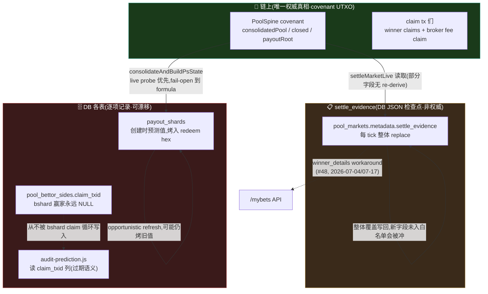
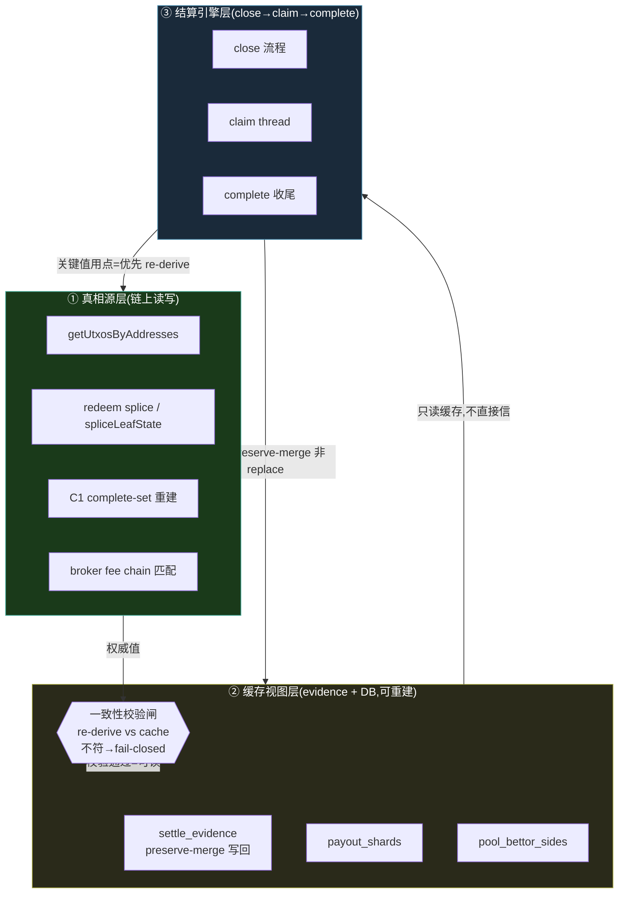
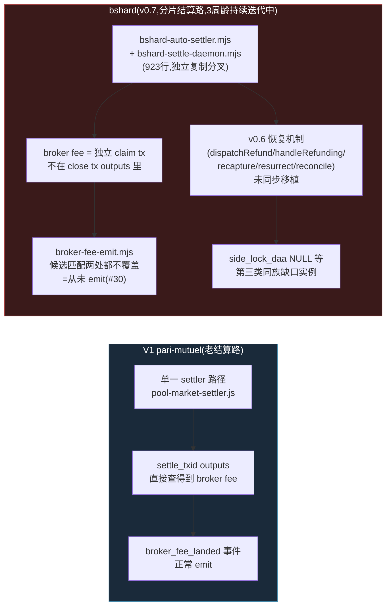
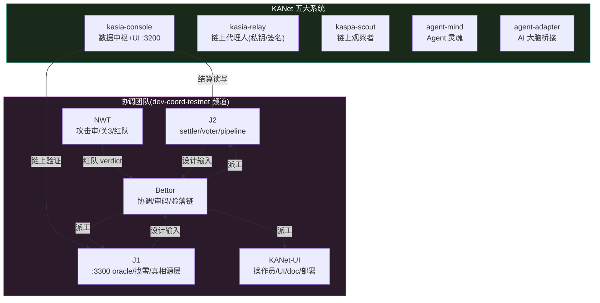

# #28 结算状态同步架构收敛 — 全案(Bettor 主编·整合 J1 分卡 v0.1 + 代码实证 + 系统画像)

> **Status**: CURRENT(v1.0 · 2026-07-21 · Bettor 主编)
> **定位**: 本卡 = Owner 钦定主线 #28 的**全案**(现状/目标架构图、模块化边界、V1-vs-bshard 复杂度对比、迭代路线、派工),吸收 J1 域分卡(`docs/2026-07-20-28-state-sync-convergence-design.md`,commit `05ff33ab`,§1-§3 原样承接)+ 本卡新增的逐点代码实证(file:line,非转述)+ DATABASE.md 文档/代码不一致发现。
> **审批序**(铁律0"设计先行"): 本卡(架构师帽,Bettor)→ **NWT 红队审**(独立,非自审)→ NWT verdict 过 → 涉钱路项(🔴)单独 Owner money-path 签发 → 派工落码。**本卡本身不改一行执行代码。**
> **触发**: 2026-07-20 世界杯决赛(85fit)结算 firefight——`consolidated_pool` 字段被 evidence 写回整块覆盖清掉→resume 用预测值→续接地址全错→claim 卡死(26/26 最终全部补救落链,零资金损失,详见 `feedback-evidence-writeback-full-replace-wipes-fields` / `feedback-exact-live-replica-beats-hypothesis-from-code-reading`)。Owner 复盘直指"多状态不统一=根病",钦定 #28 为下一主线。

---

## 0. 一句话根病(Owner 诊断,四方坐实,继承 J1 §0)

结算把**本地 DB / evidence JSON** 当"池里有什么"的真相源,但它们会跟**链上真值**脱节,脱节后无可靠对账机制。状态散在三处(**链上 covenant = 绝对真相** / `settle_evidence` = 进度检查点 / DB 各表 = 逐项记录),互相漂移,历史上的应对方式是"哪个消费者读到对不上的旧视图就单独打个补丁改它读别处"(头痛医头),不是根上把状态收敛成一份。

---

## 1. 收敛原则(#28 目标态,焊死,继承 J1 §1)

**链上 = 唯一权威真相源。`evidence` 和所有 DB 表一律降级为"可随时从链重建的缓存/视图",不再各自存一份可能对不上的独立状态。**

- 任何"关键派生值"(如 `consolidated_pool`、`payoutRoot`、claim thread 续接点)在使用点**优先从链重新派生**(re-derive-from-chain),而不是读一份可能陈旧/被覆盖的存储值。
- 缓存(evidence/DB)只做**加速**,且每次使用前带**一致性校验**(re-derive 后跟缓存比对,不符 fail-closed,不瞎跑)。多数 evidence 字段(如 `payout_root`)已经是这个模式(resume 独立重算再比对,不符 fail-closed)——这套纠错机制是好的、全程 work;`consolidated_pool` 是**唯一漏了这层**的字段,巧合掩盖到 85fit 才炸。
- **收敛 = 把"re-derive-from-chain + 一致性校验"从个别字段推广成结算全状态的统一纪律**,而非把三处状态物理合并成一张表(物理合并会丢失"链上=权威/DB=缓存"的信任层级,反而制造新的单点)。

---

## 2. 现状架构 + 漂移点清单(代码实证,file:line 全核实,非转述)

### 2.1 三处状态现状图

### 2.2 五个漂移点(J1 清单 + 本卡逐点代码实证)

| # | 漂移点 | 现象 | file:line 实证(本卡新增) | money-path |
|---|---|---|---|---|
| 1 | **consolidated_pool 被覆盖** | resume 读 undefined→formula 2021→续接地址全错→claim 卡死 | `bshard-settle-daemon.mjs:754-768` — `evidence` 对象每 tick 从零字面量重新构造(`consolidated_pool: r.consolidatedPool ?? null` 只是加了一个字段进这个字面量,**没把 write 从 replace 改成 merge**),`meta.settle_evidence = evidence`(:768)整键覆盖。`babdaed3` 只是给这个"每 tick 重造"的对象多塞了一个字段,通用坑本体未修——任何未来新增字段仍会在下一 tick 被冲掉 | 🔴 是(改结算构造值) |
| 2 | **evidence 整块 replace(通用坑本体)** | 任何字段不在当 tick 字面量枚举里就丢 | 同上 `bshard-settle-daemon.mjs:754-768`,无 `...priorEvidence` spread | 🟠 否(纯持久化机制) |
| 3 | **fresh-close 用 formula pool** | 孤儿盘 fresh-close 用预测值而非链上真值,埋下"下一个 85fit" | `bshard-auto-settler.mjs:200-226`(`consolidateAndBuildPsState`)——line 205 `predictedPool = poolSompi + PS_SEED_SOMPI`(DB 公式),line 210-224 尝试 live UTXO probe 优先取真值,**但 probe 失败/未命中时静默 fail-open 回 `predictedPool`**(:225 `consolidatedPool = consolidatedPoolReal` 当 real 未取到时仍是 predicted)。即"已经部分修了,但留了一条静默退回预测值的活路" | 🔴 是 |
| 4 | **claim_txid 列语义废弃 for bshard** | `pool_bettor_sides.claim_txid` 对 bshard 赢家永远 NULL,内部审计端点会误报"未 claim" | 列定义 `migrate.js:4060`;唯二写入点 `bettor-refund-claim-auto.mjs:126` + `pool.js:501` **都只服务退款路**,bshard 赢家 claim 循环(`bshard-auto-settler.mjs:407-460`)从未写这一列。用户面已用 `pool.js:3339-3353` 读 `settle_evidence.winner_details` 绕过(#48,NWT/J2 2026-07-04 + H2 2026-07-17 `12cce211`),但内部 `audit-prediction.js` 未跟进,仍读死列 | 🟠 否(审计工具/语义) |
| 5 | **payout_shards 创建时预测值烤入 redeem** | `payout_redeem_hex` 在创世时用 `PS_SEED`(种子值,非真实池)烤入脚本,后续"刷新"只是机会性 | schema `migrate.js:5108-5118` 无 `consolidated_pool` 列;创建写 `pool-shard-register.mjs:114-123`(`consolidatedPool: PS_SEED`);后续更新点 `bshard-close-transport.mjs:308` / `bshard-close-voter.js:667` / `bshard-settle-daemon.mjs:198` 只机会性刷新 `payout_redeem_hex`/`payout_ps_outpoint`,无强制对账触发器 | 🔴 是(影响结算构造值链) |
| 6 | **文档/代码不一致(本卡新查出,原 J1 清单没有)** | `docs/DATABASE.md:632` 描述 `pool_bettor_sides.claim_txid` = "v0.7 赢家自取 claim tx",**与代码实际(只退款路写)矛盾**,会误导下一个接位 agent | `docs/DATABASE.md:632`(待改)vs 上述 #4 实证 | 🟠 否(文档修正) |

### 2.3 verify 侧现状(已收敛的正面案例,给收敛纪律定标杆)

`bshard-auto-settler.mjs:363-368`(enforce 门)+ `:589-615`(`verifyClosedLanded`)已经是"链上真值优先"的正确范式:enforce 从**真实** `ps.consolidatedPool`(live-probed)重算地址,不用 `plan.expectedClosedAddr`(DB 预测值);`51a5623e`+`a86af952` 把两侧统一成同源真值。**残余风险**:`verifyClaimLanded`(:619)只检查"落地"不检查"金额",落地但金额错的 claim 仍会通过——收敛纪律推广时这条要一并补金额校验。

---

## 3. 目标架构(三层模块化,继承 J1 §3)

**模块归属(J1 §3 承接 + Bettor 派工):**
1. **真相源层 = J1 域**(`getUtxosByAddresses`/redeem splice/C1 重建/broker fee 链匹配——统一"从链读真值"入口)。
2. **缓存视图层 = J2 域**(evidence/DB 写回改 preserve-merge,J1 审 state 序列化正确性)。
3. **结算引擎层 = J2 域**(close→claim→complete 只从①拿真值、往②写,不再自维护会漂的独立状态)。
4. **一致性校验闸 = J1+J2 共建,NWT 审**(fail-closed 语义是安全关键路径,红队必过)。

---

## 4. V1 vs bshard 复杂度对比(本卡新增,系统"画像"第 4 张图)

**核心结论**: bshard 不是 V1 的替代重写,是并行分叉出的新结算路径,**功能对等清单从未系统核对过**——#28(状态同步)+ #30(broker 通知)+ 治本卡①(v0.6 恢复机制补齐)是同一族问题("bshard 没接住 V1 已有能力")在三个不同切面的表现,不是三个孤立 bug。

---

## 5. 迭代路线(继承 J1 §4,Bettor 加验收门)

| 阶段 | 内容 | Owner | 涉钱路 | 门禁 |
|---|---|---|---|---|
| **P0** | consolidated_pool re-derive(表 2.2 #1、#3)——使用点从链 re-derive + 一致性校验,作为收敛纪律第一个样板 | J1 | 🔴 | NWT 红队 + 补齐孤儿盘/重启穿越两个回归测试场景后 Owner money-path 签发 |
| **P1** | evidence 写回改 preserve-merge(表 2.2 #2,一次性堵住"新字段被冲"通用坑) | J2(J1 审 state 序列化) | 🟠 | NWT diff 审 GREEN 即可装载,无需 money-path(纯持久化机制,不改结算构造值) |
| **P2** | 全状态推广 re-derive+校验纪律 + 真相源层模块化(§3 完整实现) | J1 主 + J2 协 | 视具体值而定 | 分批走,每批独立 NWT 审 |
| **卫生项** | claim_txid 语义废弃标注 + audit-prediction.js 改源(#4)+ DATABASE.md 订正(#6)+ broker-fee-emit bshard 覆盖(#30) | J1(#30)+ KANet-UI(文档) | 🟠 | 正常报备审批 |

---

## 6. DoD / 验收(继承 J1 §5)

1. **回归测试(今晚缺的盲区,P0 落码前必补)**: ①带孤儿盘(consolidatedPool≠注册和)的结算 e2e;②daemon 重启穿过结算中途(close 后、claim 中途)的 resume 正确续接。这两个场景 85fit 事故当晚都没覆盖,是潜伏 bug 长期不暴露的根。
2. consolidated_pool re-derive 落码后:三源 co-verify(链上真值 vs re-derive 值 vs 一致性校验),孤儿盘/正常盘各跑一遍。
3. evidence preserve-merge 落码后:构造"新加字段"用例,验证不被 writeback 冲掉。
4. 每项涉钱路(🔴)单独 money-path 签发(Owner),非钱路(🟠)走正常报备审批。
5. **本卡新增**:`verifyClaimLanded` 补金额校验(§2.3 残余风险),纳入 P0 同批回归测试。

---

## 7. 今日派工(Bettor 主编·2026-07-21)

> 依据「设计先行→NWT 审→派实现」铁律,以下①为立即可做(红队本卡),②③为**红队 GREEN 之后**才落码;非钱路卫生项可并行走正常报备。

1. **@NWT 红队审本卡(最优先,阻塞后续落码)**: 重点核 §2(五个漂移点 file:line 是否准确、有无遗漏)+ §3 一致性校验闸的 fail-closed 语义(verify-value-source:校验闸读的"真值"来源是不是真的链上权威,不是又一层可被污染的缓存)+ §5 P0 的两个回归测试场景是否够。
2. **@J1 认领真相源层 + P0(consolidated_pool re-derive)**: 待 NWT GREEN 后落码,先出实现方案(splice vs recompile,参考已有 `verifyClosedLanded` 范式)+ 回归测试(孤儿盘/重启穿越)。今天可先做:P0 实现方案草稿(不落码,等红队)。
3. **@J2 认领缓存视图层 + P1(evidence preserve-merge)**: 待 J1 状态序列化审过后落码,可与 P0 并行(P1 不涉钱路,NWT diff 审过即可装载,不用等 Owner money-path)。今天可先做:P1 实现方案草稿。
4. **@J1 #30(broker-fee-emit bshard 覆盖)**: 卫生项,非钱路,今天可直接排、正常报备审批(不需等 #28 P0/P1)。
5. **@KANet-UI**: ① `docs/DATABASE.md:632` 订正 `pool_bettor_sides.claim_txid` 描述(表 2.2 #6);② #25(tg-bot 去重通知 `5f17088c`)——仍需轻量 Owner 确认后部署,今天若拿到 Owner-ack 请直接部署(console/tg-bot 重启会带上它,这是预期内、非意外)。
6. **待 Owner 裁**(Bettor 精炼后单点上报,不发菜单): P0/P2 具体涉钱路改动的 money-path 签发时机——建议等 NWT 红队 GREEN + 回归测试补齐后一次性上报,不分批打扰。

---

## 8. 系统整体画像(附:五大系统 + 本次协调团队,供接位者一图理解全局)

---

**关联**: J1 域分卡 `docs/2026-07-20-28-state-sync-convergence-design.md`(`05ff33ab`)、`docs/DECISIONS.md`(D-004/D-010 知识分层)、memory `feedback-evidence-writeback-full-replace-wipes-fields`、`feedback-exact-live-replica-beats-hypothesis-from-code-reading`、`project-85fit-2026-07-20-followups-25-28-30`。
