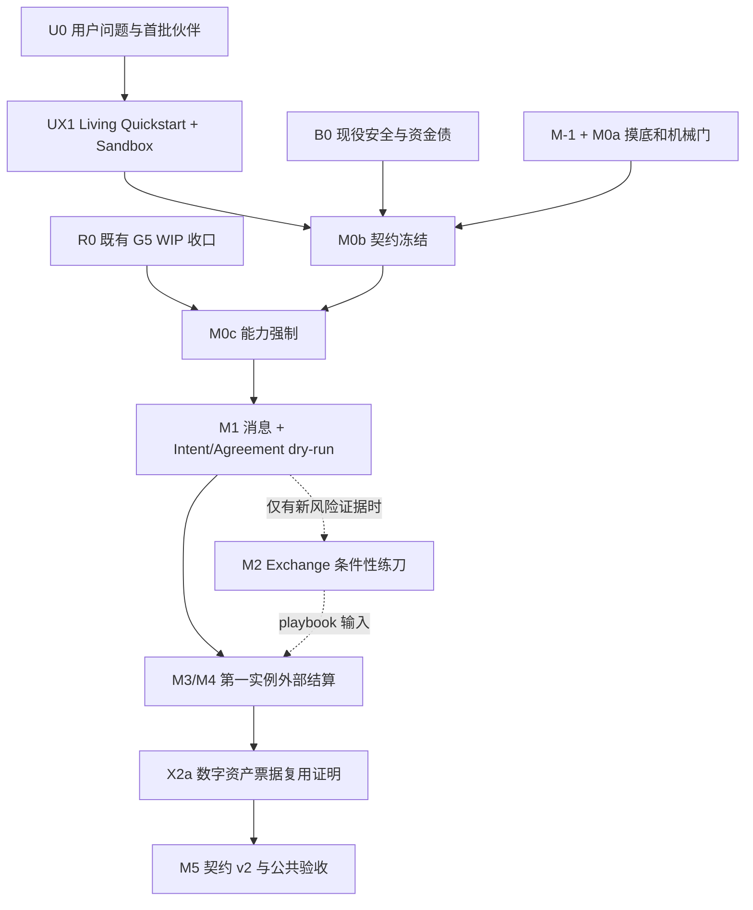

# KANet 主干执行路线图 v1.2 —— 开放经济路由与结算底座

> **Status**: FROZEN-EXECUTING  
> **审查截止**: 2026-07-25  
> **Owner 原战略令**: “只干这条，其余全部不做。”  
> **本版修正**: v1.0 主要从技术拆分与安全准入组织路线；v1.1 引入产品—系统—技术三轨；v1.2 纠正 ZK D-number 误读、恢复 EK 第二实例预注册选择、把 O1/O2 恢复为小时级首波现役雷、收缩 M0b 契约 v1，并恢复 `H0 → H1 → H2` 三级毕业梯与 O1/O2 ACK 启动期限。  
> **完整版本链**: `v1.0 → v1.1 → v1.2`。历史稿不得跳过中间版本直接解释替代原因。  
> **替代事件 1**: `v1.0 → v1.1`，2026-07-25 20:57:41 CEST（18:57:41Z）；签发来源为 Owner 的产品—系统纠偏令：“不能只站在技术角度，一定要从用户需求和系统发展角度去思考。”该事件只授权重写候选稿，不构成冻结。  
> **替代事件 2**: `v1.1 → v1.2`，2026-07-25 21:32:57 CEST（19:32:57Z）；签发来源为 Bettor 对 B0-M3、X2、B0-O2、M0b 的红队裁定，修订维护者接受并落稿。该事件纠正候选稿，不构成 Owner 冻结。  
> **v1.2 收敛修正事件**: 2026-07-25 21:55:50 CEST（19:55:50Z）；签发来源为 Bettor 终扫裁定：恢复 `H0 → H1 → H2` 毕业梯，并为 O1/O2 实名 ACK 增加授权触发后的 1 小时期限。Bettor 已明确这两处改完即签收敛、无存量异议；该签收不代替 Owner 对 A、B、C 的分别签发。  
> **Owner 冻结与执行事件**: 2026-07-25 22:06:31 CEST（20:06:31Z）；Owner 明示：“这本身就是测试网。全授权！”该指令分别签发 A、B、C 为“是”，并对本路线图依赖图内的 TN12 执行给予完整授权。  
> **当前权威**: v1.2 是唯一 `FROZEN-EXECUTING` 执行稿；v1.0、v1.1 均为 `SUPERSEDED`。  
> **内容状态**: `CONTENT-CONVERGED / OWNER-FROZEN / EXECUTING`。  
> **授权范围**: 本授权覆盖依照本路线图执行所需的 TN12 代码改动、测试网部署与重启、测试币 money-path、链上写入、签名与广播、受控高权限操作、故障修复和回滚；不要求对每个合规 TN12 package 再次向 Owner 请示。授权不取消任务卡依赖、design→NWT 红队→code→diff 审→装载顺序、失败关闭、回滚和证据要求，也不覆盖主网、法币、真实资产或路线图外产品扩张。

## 0. 文档权威与替代关系

本文件是 `docs/2026-07-22-kanet-base-modularization-roadmap-v0.2.md`（内容版本 v0.4.2）的**产品—系统—技术一体化执行视图**。它保留已经通过对抗审查的技术约束，但明确：模块化只是手段；用户能否独立完成有价值的经济闭环、不同角色能否开放加入并获得收入、第二个非预测场景能否复用同一内核，才是主干是否成立的证明。

本版补齐：

1. 把 KANet 从“预测结算后台”重新钉回“开放经济路由底座”目标；H2 前不提前取得内核命名权；
2. 明确六类用户、各自要完成的工作及最小可接受结果；
3. 把用户验证从 M5 提前到第一波，与技术清债并行；
4. 用“第一实例完成真实闭环 + 第二实例证明跨域复用”双重检验系统方向；
5. 把战略叙事改成可派工的依赖顺序；
6. 给“批零”补任务、入口、出口和证据；
7. 把当前仓库真实状态写入路线图，禁止把“已有设计”写成“已经完成”；
8. 处理 G5 已经提前进入 M0c-1、但仍被正式阻塞的现实；
9. 把后来证明影响现役系统的风险从“不做清单”中救回；
10. 给每段补 DRI、审查人、Owner 门、用户验收和 Definition of Done；
11. 把《底座最小执行契约 v1》与经济内核假说层（H0）的候选 manifest 合成同一事实来源；
12. 明确 v1.0 为 `SUPERSEDED`，v1.1 由本版替代，禁止多个当前稿并存；
13. 把“ZK D-number”恢复为 DECISIONS 决策条目问题，不再误写为协议层序号；
14. 恢复已预注册的 X2a 数字资产票据，并把 AI/API 服务降为 X2b 后继压力测试候选；
15. 把 Agent Card、Discovery、Trust Facts 从 M0b 契约 v1 移到 M5/契约 v2；
16. 指定 M0a 机械闸形成前由 Bettor 人工核卡；
17. 恢复 EK 预注册书的 `H0 假说 → H1 可复用内核候选 → H2 命名权解锁` 三级毕业梯；
18. 把 O1/O2 的实名 ACK 绑定到 C 签发或 Owner 明示第一波开工后的 1 小时期限。

版本关系：

- v1.0 历史稿：`SUPERSEDED`，只保留 18:31 技术收窄令的追溯价值；
- v1.1：由 v1.2 全文替代，不再单独作为派工入口；
- v1.2：当前唯一 `FROZEN-EXECUTING` 执行权威；Owner 已于 2026-07-25 22:06:31 CEST 签发 A、B、C 并给予 TN12 全授权。

若本文件与 v0.4.2 冲突：

- 战略、能力模型、钱路审查强度，以 v0.4.2 为技术底稿；
- **优先级、依赖、准入条件、当前状态和派工顺序，以本文件为准**；
- 本路线图依赖图内的 TN12 money-path、高权限、部署、重启、签名、广播和回滚，已由 2026-07-25 Owner 全授权事件预先批准；每次执行仍须在 bridge 绑定精确 package、参数、网络、测试币钱包/能力范围、窗口、回滚与证据，不得把全授权解释为跳过技术闸门。主网、法币、真实资产及路线图外扩张仍须新的 Owner 书面授权。

GitHub Issue #5 是交流、送审和补证通道；正式状态只以 `coordination/codex-bridge/` 的入库记录生效。文档或消息中出现的 `coord/codex-bridge/` 视为旧写法，不再作为第二套权威路径。

---

## 1. 总裁决：技术方向成立，但路线图必须由用户闭环牵引

### 1.1 战略仍成立，但表达必须升级

**“先开放结算，后做应用”只说对了一半。**

结算确实是 KANet 最难复制的能力，但用户不会购买一个抽象的“结算层”。用户要完成的是一件完整的事：

> 我有需求 → 找到能做的人或 agent → 把规则和价格说清 → 锁定承诺 → 观察进展与证据 → 条件满足后自动分钱 → 出错时能退出或换人。

因此 KANet 的主干不是单独开放 settlement endpoint，而是把以下最小经济闭环做成任何 app 都能复用的公共能力：

`身份 → 发现 → 通信/意图 → Agreement → 履约证据/裁决 → 结算 → claim/exit → 可验证记录`

预测、Exchange、AI 服务、数字商品都只是这条闭环的不同 profile。**若只把预测下注/结算开放出去，KANet 仍然只是一个预测市场后台；若把上面的通用对象和角色边界开放出去，它才开始成为 Agent Network Protocol 和开放经济路由层。**

### 1.2 北极星用户闭环

KANet 的第一阶段北极星不是注册数、API 数量或拆出的 package 数量，而是：

> 一个不由 KANet 团队控制的外部 Broker/app，不交 Telegram bot token、不交私钥、不要求修改 KANet 代码，使用自己的身份发起一笔真实 TN12 Agreement；Requester 保持资产控制，Provider/Oracle 按规则参与，结果可被第三方复算，赢家/服务者/Broker 按事前承诺获得收入，失败时存在可达的 claim/exit。

这条闭环同时证明四件事：

1. **用户价值**：有人愿意用它完成现实任务；
2. **产品价值**：接入方不用成为 KANet 内部开发者；
3. **经济价值**：开放角色能因可验证结果获得收入；
4. **系统价值**：任何单一 Broker、bot、数据库或运营者都不是最终权威。

### 1.3 六类用户与他们真正要解决的问题

| 角色 | 他要完成的工作 | 今天的主要痛点 | KANet 必须给出的承诺 | 首个可验收结果 |
|---|---|---|---|---|
| Requester / Consumer | 发布需求、选择条件、付钱并拿到结果 | 不敢信平台账本；钱被托管；不知道失败后如何退出 | 自己授权、规则先确定、状态可查、结果可证、失败可退 | 从一个外部 app 发起并完成/退出一笔 Agreement |
| Provider / Maker | 发现合适需求、履约并收款 | 获客依赖平台；平台可改规则、扣款或封号 | 开放发现、承诺不可单改、履约结果可证明、按约结算 | 非内部 Provider 接单并收到预承诺收入 |
| Broker / app / agent | 带来需求、组织交易并获得佣金 | 必须托管用户、接入深、商业模式由平台决定 | 无托管路由、协议化 fee、能力受限、可替换、无需改 KANet | 第三方 Broker 完成接入并获得一笔协议内收入 |
| Oracle / Verifier | 提交事实或验证结果并获得报酬 | 权威单点；责任与费用不清；不可替代 | 证据格式、门槛、争议/替换和报酬都预注册 | 外部 verifier 的证据被接受或被机械拒绝 |
| 开发者 / 集成方 | 快速把自己的应用接入 | 需读内部代码、交 bot token、问人、摸隐藏 env | 稳定契约、sandbox、SDK/样例、错误语义、零 KANet 改码 | 黑盒完成身份、dry-run 和一笔受限结算 |
| KANet 运营/维护者 | 保持系统可用但不成为中心裁判 | 进程、DB、密钥和人工操作承担过多权威 | 最小权限、可观测、可停机、可恢复、可审计 | 任何运行故障都不改变已承诺经济规则 |

**外部开发者只是用户之一。** 如果路线图只优化“API 好不好接”，却没有 Provider 从哪里来、Broker 为什么愿意推广、Requester 如何自保、Oracle 如何被替换，系统不会形成网络，只会形成一个更整洁的后台。

### 1.4 系统必须长成什么

KANet 的长期结构假说暂按五层组织。**H2 之前它不是已经成立的固定架构，第二层必须按毕业状态称为“经济内核假说层（H0）”或“可复用内核候选（H1）”，不得提前命名为 Economic Kernel。**

毕业梯固定为：

1. **H0 假说**：内部 Prediction 市场只是原实例；外部 Prediction/Broker app 复用同一契约闭环，证明的是契约与接入面的同领域复用，不新增“转换 × 授权”组合；
2. **H1 可复用内核候选**：X2a 作为第二个异质实例，在冻结适配预算内通过后，H0 才晋级 H1；
3. **H2 命名权解锁**：还须第三个预注册实例（X2b 或其他实例）行使实例 1、2 均未覆盖的新“转换 × 授权”组合并通过。此前不得把候选层命名为 Economic Kernel。

| 层 | 权威对象 | 说明 |
|---|---|---|
| Kaspa 结算层 | transaction / UTXO / covenant evidence | 最终资产与不可抵赖状态 |
| 经济内核假说/候选层（H0 → H1；H2 后方可命名） | Agreement、Value Event、Settlement、Claim、Exit、Receipt | X2a 通过前为 H0；X2a 通过后为 H1；第三实例新增组合并通过后才解锁 H2 命名权 |
| KANet 协议层 | Address Identity、Agent Card、Discovery、Intent、Message、Trust Facts | 让人和 agent 能找到、理解并选择彼此 |
| Role / Adapter 层 | Broker、Provider、Oracle、Executor、prediction/AI/API profile | 把通用协议映射到具体场景 |
| 体验层 | Telegram、Web、MCP、其他 agent runtime | 可替换入口；不得成为身份、账本或资产权威 |

由此得到四条系统纪律：

1. Kaspa 地址是可持续迁移的网络身份；Telegram、MCP 或某个 agent runtime 只是入口；
2. KANet 的目标是协议和开放经济路由底座，不是 AI 框架，也不拥有 UI；H2 前只按 H0/H1 状态称呼候选层；
3. 预测系统是第一实例，不是协议边界；
4. “可发现、懂政策、事实可观察、信任可组合”必须进入演化路线，不能永远停留在白皮书。

### 1.5 v1.0 的根本缺口

v1.0 的技术裁决基本成立，但仍不能直接冻结，原因不止技术：

| 缺口 | 为什么是阻塞 |
|---|---|
| 用户验证被放到 M5 | 团队会先投入全部拆分成本，最后才知道用户是否需要、怎样需要 |
| “外部程序”被当成唯一用户 | 忽略 Requester、Provider、Broker、Oracle 的需求与激励，无法形成网络 |
| 将“开放结算”近似成 Prediction API | 容易把预测领域对象固化进内核，KANet 退化为垂直后台 |
| 文档和 sandbox 被视为收尾 | 失去最便宜、最早暴露接入摩擦的产品探针 |
| 只有 90 天最终否证，没有阶段性漏斗 | 无法区分“没人感兴趣”“想用但进不来”“能用但无复购”“没有正向经济性” |
| Exchange 被设为必经练刀 | 它可能优化内部拆分，却不一定缩短外部用户首笔结算时间 |
| “批零”只有三个名字，没有 DoD | 团队无法判断何时真的清完，也无法防止口头宣布完成 |
| G5 已提前进入 M0c-1，但 M-1/M0b 尚未闭合 | 能力机制在能力清单和公开契约之前落码，顺序倒置 |
| 不做清单冻结了现役风险 | 会把紧急停机失效、执行链污染和生产身份不确定一并冻结 |

### 1.6 本版优先级修正

1. **用户轨与技术轨从第一天并行。** 批零阻塞真钱与契约冻结，但不阻塞用户访谈、外部设计伙伴筛选、living Quickstart、mock/sandbox 和只读接入测试。
2. **文档不是第五段包装。** 每一段都交付可运行样例和相应版本的黑盒测试；M5 只负责冻结与公共发布。
3. **预测作为第一实例。** 它优先复用现有资产完成第一笔外部结算，但不得把 prediction-specific schema 写成通用内核。
4. **必须有第二实例。** 按既有 EK 预注册书，X2a 固定为 covenant 原生数字资产票据：交割客观、原子、零 oracle、零主观验证。它在冻结适配预算内复用同一 Agreement/Value Event/Settlement/Claim/Exit 候选内核后，只允许把 H0 晋级为 H1（可复用内核候选）。
5. **AI/API/数字服务只保留为 X2b 后继暨 H2 晋级候选。** 它不得无声替代 X2a；只有其预注册并行使实例 1、2 均未覆盖的新“转换 × 授权”组合后，才可参加 H2 晋级检验。若其完成条件不能严格机械判定，必须另行预注册 Result Authority、Verifier 权限与退出模型，并由 Owner 明确批准边界扩展，而不是偷渡进 H0/H1 候选边界。
6. **Exchange 抽离降为条件性技术练刀。** 只有能在预设预算内直接降低第一实例的抽离风险时才做；不能提供新证据即停止，不再作为产品主线必经关。
7. **G5 只准完成既有 WIP 收口和证据闭合。** 不准运行，不准被计为 M0c-1 完成。
8. **批零不阻塞只读摸底和 lint 设计，但阻塞契约冻结、能力启用、外部真钱暴露和 money-path 装载。**
9. **现役控制风险升入批零。** 紧急停机、健康监控、消息字节不被执行、生产运行身份、能力状态可见性。
10. **第一段严格按 `M-1 → M0a → M0b → M0c`。** M0c 不得再越过 M0b。

---

## 2. 大白话逐段解释：用户买的是“事情办成”，不是技术层

### 2.1 战略：不要继续造出租车，要造别人都能接的收费公路

预测、下注、撮合只是“车”。界面好不好看、机器人功能多不多，别人都能追上。真正稀缺的是下面那条能安全走钱、出问题还能追责和退出的“路”。

所以 KANet 的正确赌法是：让别人自己的车能上我们的路。每接进一个外部程序，KANet 就多一个场景；我们自己再做一个应用，只是多养一辆自己的车。

但还要再补一句：**用户不是为了“上路”而上路，他是为了把货送到。** 对 KANet 来说，“货送到”就是需求被表达、合适的人被找到、结果被证明、各方按约拿到钱。因此 API、模块化和权限只是公路的入口与护栏，不是产品价值本身。

### 2.2 KANet 是什么：不是预测市场，而是程序之间的裁判和结账机

两个互不认识的程序要交易，通常只能信一个中间人，或者各自学会链上开发。KANet 要提供第三条路：双方事先把规则写清，把允许的动作限定住，条件满足后按证据结算。

但这句话必须诚实。当前外部接入仍要求把 Telegram bot token 交给 KANet 保管，这仍是“你先信我”。因此第一批真正要拆掉的，不是某个目录，而是这种信任依赖。

### 2.3 为什么先模块化：不先装墙和门锁，开放 API 就是在墙上打洞

现在很多代码共用同一个数据库、进程、事件循环和 relay 出口。直接开放接口，外部请求就会落进我们的内部房间：

- 一次坏调用可能拖住整套系统；
- 权限只能靠代码临时判断；
- 内部一改，外部调用就可能碎；
- 外部应用被攻陷时，爆炸半径无法证明。

模块化在这里不是“把文件搬进新目录”，而是每个调用者只能拿到写死的能力，而且越权动作一定失败。

### 2.4 批零：先把旧账和现役雷处理掉，再把边界冻成对外承诺

系统已经存在几笔安全和资金正确性债务。它们不先处理，后面一旦把 API 契约冻死，就等于把 bug 也写进对外承诺。

但批零也不能把所有摸底工作卡死。因此本版规定：

- 只读调查、清单、设计、lint 可以并行；
- 任何能力启用、money-path、外部暴露和正式契约冻结，都必须等批零关闭。

与此同时，用户访谈、外部设计伙伴筛选、Quickstart 草稿、mock API 和 sandbox 不能等。它们不碰钱，却能提前告诉我们：别人究竟想怎样接、愿意为什么付费、哪一步最难。

### 2.5 第一段：先数清钥匙，再决定谁拿哪把钥匙

先列出所有命令和经济效果，再建立能力矩阵，最后装上默认拒绝的能力闸。

完成不是“权限代码写完了”，而是拿受限凭证故意越权，所有越权都被拒，而且数据库、链上状态、预算和审计记录都没有副作用。

### 2.6 第二段：把四个门收成一个门

现在消息分发有多套路径。第二段不是把代码合并得漂亮，而是保证：

- 一个消息只能落到一个 handler；
- 未知消息拒绝；
- 重复注册直接失败；
- handler 出错不能换另一个 handler 再试；
- 授权必须在任何副作用之前完成。

### 2.7 条件性练刀：Exchange 只在能降低首笔结算风险时做

Exchange 相对简单，适合验证“一个应用能否从单体抽出来”。目标只是产出一套可复用的拆法和失败处理经验。

但它不再是不可跳过的主线。若两三个小批后仍不能证明它直接降低外部 Prediction/Agreement 接入风险，就停止；不能因为内部代码更好拆，反而让真实用户更晚看到可用闭环。

### 2.8 第三段：真正把预测结算拆成外部可用能力

这是最难、也最有价值的一段。要先把资金真相源、V1 drain、恢复路径和结算 daemon 收干净，再开放“下注—裁决—结算”能力。

这一段完成后，外部应用才能真正发起一笔受限、可验证、可恢复的结算，而不是只调用一个展示接口。

### 2.9 第四段：不能只用预测证明“通用”

一把钥匙能打开自己家门，不能证明它是通用钥匙。预测闭环跑通，只能证明 KANet 能支撑预测。

所以第二实例先选 covenant 原生数字资产票据：一项数字权利被明确承诺，付款与交割由 covenant 客观、原子地完成，不依赖 oracle 或“谁觉得服务做得好”的判断。如果同一套身份、Agreement、Value Event、结算、claim/exit 能在严格适配预算内复用，才说明我们抽出来的是 H1 可复用内核候选，而不是把预测代码换了名字。AI/API 服务等带主观完成条件的场景留给 X2b，作为 H1 之后另行预注册的 H2 晋级候选。

### 2.10 第五段：把契约冻死，让陌生人零提问接入

文档与示例从第一段就开始随契约生长，第五段只是把已经被外部人反复使用过的东西冻死。最后的标准不是团队自己会用，而是一个从未看过代码的人，只拿文档就能完成：

1. 建立身份；
2. 发送一条合法消息；
3. 发起并完成一笔受限结算；
4. 导出第三方可验证证据；
5. 尝试越权并被拒。

只要还要私聊团队问隐藏步骤，就不算开放完成。

### 2.11 执行纪律：每张卡必须先回答“为谁解决什么”

任何任务如果说不清目标用户、用户要完成的工作、可观察结果，以及它怎样缩短“首次有价值结算”，就不应开工。每张卡还必须有合法 `batch`，否则接卡人机械拒绝。

这不是靠大家记得，而是靠任务入口、lint、review 模板和状态机共同强制。

---

## 3. 冻结目标与非目标

### 3.1 唯一主目标

完成一个**能力受限、默认拒绝、可独立验证、角色可开放加入的 KANet 经济路由与结算底座**，使一个外部程序能够：

- 不交出自己的 Telegram bot token、私钥或等效控制凭证；
- 获取独立 caller identity；
- 发布/路由一个版本化 Intent 或 Agreement；
- 发现或指定 Provider、Broker、Oracle/Verifier；
- 只调用被授权的身份、通信、证据、结算和退出能力；
- 把权限限定到具体 network、wallet、market、outpoint、entrypoint、amount、recipient 和 rate；
- 重放、越权、跨钱包、超额、错网络或错分支时 fail-closed；
- 在 KANet 不可信或离线时，仍能验证已有结算结果和可达退出；
- 让参与角色按事前承诺获得收入，而不是靠运营者事后记账；
- 不改一行 KANet 代码完成接入。

本目标的产品接入与内核毕业分级证明：

1. **同领域接入证明**：外部 Prediction/Broker app 完成一笔 TN12 真实闭环；它与内部 Prediction 原实例属于同一领域，只证明 KANet 已从内部预测系统变成可外接的预测结算，不增加新的“转换 × 授权”组合；
2. **H1 晋级证明**：第二异质实例 X2a——covenant 原生数字资产票据——在冻结适配预算内复用同一候选内核；
3. **H2 晋级证明**：第三个预注册实例行使实例 1、2 均未覆盖的新“转换 × 授权”组合并通过；X2b 是候选，但不在 v1.2 执行主链。

只有同领域接入完成，KANet 是“可外接的预测结算”；X2a 通过后，只可称“H1 可复用经济路由内核候选”或“开放经济路由底座候选”；第三实例通过前，不得把产品级短语“开放经济路由内核”与 Economic Kernel（H2）混用。

### 3.2 明确非目标

- 不把预测应用继续做大做全；
- 不把 Prediction schema、market vocabulary 或 Telegram 流程冒充通用 Agreement 协议；
- 不转主网；
- 不继续投入 rolling / covenant 跨节点；
- 不做与外部安全接入无关的通用美化、目录整理或重构；
- 不一步微服务化；
- 不物理拆库作为当前目标；
- 不为了证明通用性而由 KANet 团队再做一个大型自有应用；
- 不以代币升值、流量或注册数代替结算需求验证；
- 不把 fee-split 的 49 秒接入当成“碰钱、碰状态、碰签名”的抽离证据。

### 3.3 唯一战略否证

最终否证仍以以下条件同时满足为准：

1. 第一实例和 X2a 技术验收完成；
2. 外部接入文档、示例、测试凭证和 sandbox 可公开获得；
3. 至少完成一轮有记录的目标开发者邀请与接入窗口；
4. 仍然没有一个外部程序提交有效接入尝试。

当前只有“注册账号 26 个，且最近部分为内部测试号”的数字，既不能证明有需求，也不能证明没有需求。

但不应等到最后才学习。阶段性诊断必须区分：

| 观察 | 说明 | 路线图动作 |
|---|---|---|
| 目标用户连 sandbox 都不愿尝试 | 价值主张或目标用户可能错 | 暂停深拆，重新选 beachhead |
| 愿意尝试但无法完成身份/dry-run | 接入门仍窄 | 修入口、文档、credential 和错误语义 |
| 能 dry-run 但不愿走真实结算 | 信任、资金风险或场景价值不足 | 修托管/退出/经济承诺，不继续堆 API |
| 完成一次但不重复 | 价值频率或角色收益不足 | 检查用户工作流与 fee 模型 |
| 第一实例成功、X2a 适配爆炸 | 抽出的仍是预测内核 | 停止宣称通用，收缩/重画 Agreement 边界 |

---

## 4. 当前研发状态快照

> 本节只记录截至 2026-07-25 已核验状态。后续状态变化必须以新的 commit、测试和 bridge 记录更新，不得靠口头覆盖。

| 范围 | 当前证据 | 裁决 |
|---|---|---|
| 主分支 | GitHub 默认分支为 `master`，公开最近提交停在 2026-07-21；实际活动集中在 `bshard-m3-deploy` 等分支 | 默认分支不能代表当前执行状态 |
| 协作通道 | Issue #5 已成为送审和补证通道 | Issue 评论不是正式状态；bridge 才是正式状态 |
| M0c-1 / G5 | 已接受 package `5b804ed094d9e24c95e38b1d5a2955a738c8f830` 本身未撤销，但 G5 不属于该 package | `BLOCKED_DO_NOT_RUN_G5` |
| G5 活动分支 | 最新核验仍为 `557554fd5ba8f4ba110b016b273f596c6cfbe121` 的 pre-fix WIP；十二项修复未形成最终干净提交 | 不可当成完成态、不可装载 |
| G5 测试 | WIP commit 明确写明相关回归未执行，多个 fail-open 缺陷仍在 | “测试文件存在”不等于“测试通过” |
| 运行身份 | 已报告生产与开发 checkout 混用、19 个 untracked 文件、依赖版本在会话内变化、缺 installed-dependency integrity gate | future money-path activation 的 P0 阻塞 |
| 消息传输 | 仅部分 sender file-only；仍有 inline 路径，且存在未引用 heredoc 的解释面 | 必须证明端到端字节不被执行 |
| M-1 | 35 条 A/B/C 描述性分类已完成；全量约 50 条能力/效果清单、完整 capability matrix 和 caller 身份机制终选仍未闭合 | PARTIAL |
| M0a | 差分 lint/manifest 已实际拦住过未获 review_ref 的测试文件，说明机制开始生效 | PARTIAL；尚无全阶段关闭证据 |
| M0b | 未见已经冻结并可作为唯一事实来源的《底座最小执行契约 v1》 | NOT CLOSED |
| M0c | 有 caller/default-deny 方向和 G5 prototype，但无完整三子批、越权 probe、吊销、重放和 live evidence 闭环 | PARTIAL / BLOCKED |
| EK 三项既有沉淀物 | 内容与命名沿用既有预注册包，不在本路线图凭记忆重写 | `FROZEN-EXECUTING`；候选 manifest 于 M0b 合流；Owner 已签发 X2a 为主选型，X2b 不进入本版执行主链 |
| M1 | 原稿仍记录四套 dispatch 需收敛 | NOT STARTED AS ROADMAP BATCH |
| M2 | fee-split 已证明纯函数包可抽离；未证明钱、状态、签名应用抽离 | NOT STARTED |
| M3a | #28 真相源层已有部分完整回执和测试成果 | PARTIAL ASSETS EXIST |
| M3b | v0.4.2 的最后冻结快照为 23 条 V1 非终态义务；执行前必须重新只读刷新 | NOT CLOSED |
| M3c / M4 / M5 | 无完整 DoD 证据 | NOT STARTED |

### 4.1 当前最重要的事实

**G5 不是“差一点就能跑”的发布候选，而是一个已经暴露多层执行身份、预算、journal、恢复和证据问题的安全原型。**

它的价值是帮 M0c-1 找出了真实边界；它的状态仍是阻塞。路线图不得为了“把已经做的做完”而让它反过来绑架优先级。

### 4.2 从用户与系统发展看，当前还缺什么

| 缺口 | 当前影响 | 优先裁决 |
|---|---|---|
| 没有明确的首批外部设计伙伴与 beachhead 记录 | “外部需要什么”仍主要靠内部推演 | 第一波建立目标用户名单、问题访谈和接入意愿证据；未授权前不作外部承诺 |
| 注册 26 个，但无完整漏斗 | 不知道用户停在发现、身份、下注、结算还是 claim | 建立匿名化 journey telemetry；注册数不再作为核心指标 |
| Telegram bot token 托管 | Broker/app 不能保持控制权，也无法规模接入 | 第一段必须给独立 caller identity 与 revoke |
| Agent 读取层/世界模型不完整 | Agent 能发消息但看不清 Agreement、对手方、证据和退出 | read/query API 与 capability status 进入最早外部能力 |
| 现有对象偏 Prediction/market | 容易把第一实例写进协议骨架 | 冻结通用 Agreement/Value Event/Settlement profile，prediction 仅作 adapter |
| Broker 收入只是愿景，未成黑盒验收 | 外部 app 缺长期接入动力 | 第一实例必须证明一笔协议化 Broker fee |
| Provider/Oracle 发现与替换未进入执行主线 | 系统仍需团队人工组织角色 | 第一实例和 X2a 允许显式地址/人工对接；Agent Card、Discovery、Trust Facts 到 M5/契约 v2 再进入 |
| docs/sandbox 只在 M5 | 无法早测接入摩擦 | 从第一段建立 living Quickstart 和 mock/sandbox |
| 没有 X2a 第二非预测实例 | 无法证明跨域复用 | 在公共发布前完成 X2a 适配预算检验 |
| claim/exit/故障状态主要是内部术语 | 用户无法判断钱是否安全、下一步怎么办 | 对外状态必须使用可行动的 lifecycle 与错误语义 |

### 4.3 首个 beachhead 与第二实例裁决

在不新增自有产品主线的前提下，本版按 EK 预注册书恢复如下顺序，等待 Owner 冻结：

1. **第一实例：外部 Prediction/Broker app。** 理由是 KANet 已有最深的链上结算、裁决、claim 和失败恢复资产，能最快验证“外部 app 是否真能复用”。
2. **第二实例 X2a：covenant 原生数字资产票据。** 选择它不是因为场景最炫，而是因为交割客观、原子、零 oracle、零主观验证；它能以最低成本攻击能力矩阵是否真正跨域，而不把新裁判问题混进 H0/H1 候选边界。
3. **后继候选 X2b：按结果付费的 AI/API/数字服务。** 只有输出能被严格机械判定时，才可复用 X2a 的验证边界；否则必须另立预注册书，明确新 Result Authority、转换×授权组合、争议与退出，并由 Owner 单独 supersede/扩展。X2b 不属于 v1.2 冻结执行主链。
4. **Exchange 不作为第二实例。** 它可以做受限技术练刀，但与现有金融/市场域过近，也主要是内部模块，不能充分证明外部跨域需求。

**EK 预注册同步状态：**本版选择第三条治理出路，即 `X2a 数字资产票据先行 / X2b AI/API 服务后继`。这不是 supersede EK 预注册草案 §3，而是撤销 v1.1 对路线图的无声偏离：EK 的当前主选型继续保持“实例 2 = covenant 原生数字资产票据”，无需把 AI/API 写回现有 EK 草案。X2b 必须另立预注册书并取得 Owner 裁决；在此之前，它只是 backlog，不构成对 EK 草案的修订。路线图、EK 候选 manifest 与后续 DECISIONS 条目均须反向链接本段，禁止再次出现两份 `FREEZE-CANDIDATE` 对 X2 给出不同主选型。

X2a 不是立即开做产品；当前只恢复既有预注册选择、对象模型、适配预算与未来验收。未通过第一实例前，不投入其完整实现。

---

## 5. 依赖图与并行规则



图中的实线是产品与系统毕业必经路径；虚线是条件性技术实验。**M2 不再拥有阻塞第一实例的天然资格。**

### 5.1 允许并行

- B0 的只读取证、设计与 M-1/M0a 可并行；
- U0 用户问题验证、候选伙伴档案、journey map、living docs 和 mock/sandbox 可与 B0 并行；
- R0 的既有 WIP 收口可并行，但不得扩大范围；
- J1 的真相源调查与 J2 的 ZK/claim 调查可并行；
- KANet-UI 先做只读 live 取证；后续 TN12 重启、切换、装载、POST、签名、广播和测试币动作在精确 package、NWT verdict、回滚和 receipt 入 bridge 后，由本次 Owner 全授权直接放行。

### 5.2 禁止并行

- M0b 不得在 B0 和 M-1 输出不完整时冻结；
- M0b 不得只由内部人阅读后冻结；至少要经过一次基于 Quickstart/mock 的外部或“从未接触仓库者”契约可理解性测试；
- M0c 不得在 M0b 之前启用；
- M1 不得在 M0c 负向能力 probe 完成前让新进程触达 relay；
- M3c 不得早于 M3a+M3b；
- M4 不得在 settleMarketLive 假完成、claim-complete 和 ZK/rolling DECISIONS 条目未闭合时冻结对外钱路契约；
- X2a 不得早于第一实例闭环；不得为了赶“第二实例”由 KANet 团队扩建第二个大型产品；
- X2b 不得进入 v1.2 执行主链；任何启动都必须有新的预注册书和 Owner 明确 supersede/扩展裁决；
- M5 不得把内部私聊、隐含 env、未列出的 secret 或人工数据库操作写成“接入步骤”。

---

## 6. 优先级定义

| 优先级 | 定义 | 当前任务 |
|---|---|---|
| P0-SAFETY | 会让紧急停机失效、让消息被执行、让错误运行树触达钱路、或让系统对自身健康失明 | B0-O1～B0-O5 |
| P0-MONEY | 可能把未完成写成完成，或让合法 claim 不可达 | B0-M1～B0-M2 |
| P0-GOVERNANCE | 既有 Owner 裁定没有形成正式 supersedes 决策链，导致 agent 按过期术语或字面猜义执行 | B0-M3 |
| P0-USER-EVIDENCE | 在继续深拆前弄清首批用户、工作流、接入障碍和付费/分成动机 | U0、UX1 |
| P1-ENTRY | 外部身份可独立进入、查询和 dry-run，不交控制凭证 | M-1、M0a、M0b、M0c、living SDK |
| P2-AGREEMENT | 将多入口收成版本化 Intent/Agreement 入口，并给出生命周期与可行动错误 | M1 |
| P3-FIRST-VALUE | 让外部 app 完成第一笔可验证、可 claim/exit、含 Broker 收入的结算 | M3、M4 |
| P3-EXTRACTION-SPIKE | 仅在能降低第一实例风险时做受限抽离实验 | M2 |
| P4-REUSE | 用客观、零 oracle 的第二非预测实例检验 H0，并在通过后晋级 H1 | X2a |
| P5-NETWORK | 角色发现、替换、信任事实、公共文档与外部需求验证 | M5 |

P0-USER-EVIDENCE 与 P0-SAFETY/P0-MONEY 并行，但不得借“用户研究”触发 live、资金、外部承诺或绕过 Owner 授权。

同一优先级内，NWT 审查队列顺序固定为：

1. 会影响现役停机、生产执行身份或资金真相的卡；
2. R0 已开始 WIP 的最终收口；
3. M-1/M0a 的设计与机械门；
4. UX1 中与契约/权限有关的 mock、Quickstart 和黑盒测试设计；
5. 后续批次。

不得用“已经投入很多时间”提高优先级。

---

## 6A. 用户轨 —— 不等技术毕业才见用户

### 6A.1 U0 首批用户与问题证据

| 字段 | 内容 |
|---|---|
| `batch` | `U0-BEACHHEAD-EVIDENCE` |
| DRI | Bettor |
| 技术协作 | J1、J2 |
| Owner 门 | 对外联系、承诺接入时间、费用或能力之前需 Owner 同意统一口径 |
| 目标 | 找到“确实需要开放结算，但不愿自建链上钱路/托管用户”的首批 Broker/app |

交付：

1. 第一实例的目标用户画像、现有替代方案、最痛步骤和触发频率；
2. 至少覆盖 Requester、Provider、Broker、Oracle、开发者的端到端 journey map；
3. 候选外部设计伙伴清单及选择理由；内部测试号不得计入；
4. 统一的 20～30 分钟问题访谈提纲，禁止用产品宣讲代替问题发现；
5. 用户愿意尝试的最小版本：read-only、dry-run、capped TN12 settlement 三档；
6. 明确“不愿尝试”的原因，是无需求、信任不足、流程不合、集成成本还是经济性不足。

DoD：

- 完成不少于 5 次合格外部问题访谈，至少覆盖 2 种入口/app 形态；同一组织的多人只计一个需求方；
- 每条“用户需要”可指向原话/行为证据，不用团队脑补代替；
- 记录当前替代方案和切换成本；
- 不把“觉得有意思”“愿意注册”记为有效需求；
- 至少有 2 个非内部候选愿意各自投入时间评审 Quickstart/mock，其中至少 1 个实际开始黑盒尝试，才进入 UX1 外部黑盒轮；
- 若无人愿意评审，先改目标用户/价值主张，不扩大技术范围。

以上 `5 / 2 / 1` 是本版预注册建议，可由 Owner 在冻结前修改；冻结后不得因结果不好而降低。

### 6A.2 UX1 Living Quickstart、mock 与 sandbox

| 字段 | 内容 |
|---|---|
| `batch` | `UX1-LIVING-QUICKSTART` |
| 产品 DRI | Bettor |
| 契约 DRI | J2 |
| 集成验证 | KANet-UI |
| 红队 | NWT |

从第一段开始维护一个“随系统生长”的接入包：

- 五分钟解释：KANet 为谁解决什么；
- caller identity 与 capability 获取流程；
- read-only status/proof 查询；
- mock `Intent → Agreement → Value Event → Settlement → Claim/Exit`；
- 可复制请求/响应；
- 费用、超时、错误、重试与撤销；
- sandbox 测试凭证；
- 每个版本的已知限制；
- 外部评审者的提问与失败位置。

DoD：

- 文档示例由 CI 实际运行，不能复制过期片段；
- mock 与 M0b manifest 同源生成；
- 未实现能力明确标 `NOT_AVAILABLE`，不得用愿景假装已经可用；
- 每阶段至少一次“从未接触仓库者”黑盒测试；
- 每个失败点形成产品/契约/实现三选一归因，不笼统写“用户不会用”。

### 6A.3 用户漏斗与北极星指标

| 层级 | 指标 | 不接受的替代指标 |
|---|---|---|
| 发现 | 合格目标用户看到并理解价值主张的人数 | 曝光量、粉丝量 |
| 意向 | 愿意投入时间评审 mock/sandbox 的外部 app | 点赞、口头支持 |
| 激活 | 独立获得 identity 并完成首个 read/dry-run | 注册账号 |
| 首次价值 | 完成一笔真实 TN12 Agreement 并拿到 proof | hello world、内部 bot |
| 完整闭环 | Provider/Oracle/Broker/Requester 的收入、claim 或 exit 全部闭合 | 只看到 txid |
| 可重复 | 同一外部 app 第二次独立完成 | 团队代操作 |
| 可扩展 | X2a 在适配预算内完成 | 再建一个 KANet 自有 app |

必须同步记录：

- time-to-first-dry-run；
- time-to-first-settlement；
- 支持提问次数与每步流失；
- KANet 代码改动数；
- 交出控制凭证数（目标恒为 0）；
- 失败后可恢复/退出率；
- Broker、Provider、Verifier 实际获得的协议内收入；
- 同一契约在 X2a 的适配 Diff。

---

## 7. R0 —— 既有 G5 WIP 收口，不得运行

### R0-1 任务定义

| 字段 | 内容 |
|---|---|
| `batch` | `R0-G5-CLOSEOUT` |
| DRI | J2 |
| 方向/调度 | Bettor |
| 红队 | NWT |
| 独立复审 | Codex |
| 当前基线 | 活动分支 pre-fix WIP `557554fd5ba8f4ba110b016b273f596c6cfbe121` |
| 允许范围 | 只完成已经公开列出的十二项修复、clean-tree 回归、source/package/evidence 闭合 |
| 禁止范围 | 不得新增能力、不准 G5 POST、不准重启、不准 re-arm、不准 grant、不准 reconcile release、不准签名/广播/资金动作 |

### R0-2 必须交付

1. 一个不再标记 WIP 的单一 source commit；
2. 十二项修复逐项映射到 file/blob/test；
3. 从干净树实际执行的回归日志；
4. read-only TN12 RPC + stub gateway 的 no-spend executability harness；
5. source commit、package commit、generator/harness blob、测试命令、退出码、证据 digest 的不可变 bundle；
6. Issue #5 review request；
7. bridge 正式 verdict。

### R0-3 退出条件

R0 关闭只表示“G5 原型变成可审对象”，**不表示允许运行，也不表示 M0c-1 完成**。

G5 只有在 B0、M-1、M0a、M0b 全部关闭，并获得 Owner 对精确 package、wallet、relay、grant、network、scope、amount 和执行窗口的授权后，才可重新申请运行审查。

---

## 8. B0 —— 现役安全与资金债

### 8.1 B0 总闸

B0 未关闭时：

- 每张卡的第一步仍是只读取证、设计、离线测试和现有 WIP 收口；
- TN12 live 修复、部署、重启、money-path、签名、广播或受控高权限动作可在对应卡完成精确 package、NWT 红队、diff 审、回滚设计和证据计划后，依 Owner 全授权直接执行，不再逐项回请；
- B0 未关闭前，不得对外冻结尚未经过 M0b 的 money-path 契约，不得让新 caller 越过对应 capability/grant/replay/amount 闸获得 relay/sign/submit/transfer 能力；
- `BLOCKED_DO_NOT_RUN_G5` 继续约束当前已知坏包；只有其文内前置条件和 G5 自身验收闸全部通过后，才可在 TN12 全授权下运行；
- 禁止把预测模块跨边界搬迁并宣布完成。

**O1/O2 小时级时钟：**

- `T-authorize` 是 C 签发或 Owner 明示第一波开工中较早发生的时刻；它只启动派工响应义务，不扩大 C 中列明的授权范围；
- `T-authorize + 1h` 前，Bettor 必须对 O1、O2 两张 0A 卡分别向具体执行人发出实名 ACK，或在 bridge 记录具体阻塞原因、责任人和下一次裁决点；
- `T0` 是 Bettor 向具体执行人发出实名 ACK 的时刻；无实名 ACK 就没有执行人，但不得以不发 ACK 规避上一条的响应期限；
- `T0 + 1h` 前，O1 与 O2 均须写入 `STARTED`、只读取证范围和禁止动作；
- `T0 + 4h` 前，均须交首份证据快照与 `PASS / BLOCKED / NEEDS-LIVE-FIX` 三态裁决；
- O1/O2 不得排到用户访谈、mock、R0 或其他天级账之后；
- O1/O2 必须先完成只读取证与离线分析；若三态裁决为 `NEEDS-LIVE-FIX`，执行人可在精确 package、NWT verdict、回滚和 receipt 计划入 bridge 后，依本次 TN12 全授权实施，不再逐项回请 Owner。

### 8.2 B0-O1 紧急停机完整性

| 字段 | 内容 |
|---|---|
| `batch` | `B0-O1-KILL-SWITCH-INTEGRITY` |
| DRI | KANet-UI |
| 红队 | NWT |
| 紧迫度 | 小时级；适用 §8.1 的 `T0 + 1h / T0 + 4h` 时钟 |
| 执行门 | 任何进程、watchdog、env、启动项或 live 配置变更前，必须形成精确 package、NWT verdict、回滚和 receipt；满足后由本次 TN12 全授权直接放行 |
| 已知风险 | watchdog 可能把紧急停机自动撤销；旧 pid 文件与活进程不一致 |

DoD：

1. 只读列出所有能 arm/unarm、重启、恢复 gateway 的进程和启动项；
2. 建立“Owner 紧急停机后，任何自动进程都不能自行恢复”的机械不变量；
3. 负测试：stop/unarm 后 watchdog、supervisor、重启脚本和 stale pid 均不能恢复能力；
4. 保留 immutable receipt：进程、参数、env 摘要、pid、DB、commit、测试结果；
5. 精确 package 通过 NWT 红队和 diff 审、回滚与 receipt 入库后，依 TN12 全授权装载；装载后重复负测试。

### 8.3 B0-O2 健康监控恢复

| 字段 | 内容 |
|---|---|
| `batch` | `B0-O2-HEALTH-MONITOR` |
| DRI | KANet-UI |
| 红队 | NWT |
| 紧迫度 | 小时级；与 O1 同列，适用 §8.1 的 `T0 + 1h / T0 + 4h` 时钟 |
| 已知风险 | 健康监控无进程，预期日志不存在，系统对自身健康失明 |

DoD：

1. 明确 monitor 的单一属主、启动方式、心跳、日志路径和告警出口；
2. 负测试：monitor 不运行、日志不可写、RPC 连续失败、sender 失败时必须显式报警；
3. monitor 故障不得阻塞 settlement/refund；
4. restart 后 monitor 自动恢复，但不得自动 re-arm 已停能力；
5. 形成可独立核验的 readiness receipt。

### 8.4 B0-O3 消息字节端到端不执行

| 字段 | 内容 |
|---|---|
| `batch` | `B0-O3-NON-EVALUATING-TRANSPORT` |
| DRI | KANet-UI |
| 红队 | NWT |
| 范围 | author file → composition → sender → transport → storage → read-back |

DoD：

1. 五个 canonical sender 全部接受文件/字节输入，不通过 shell、模板替换、命令替换或生成脚本解释 payload；
2. inline sender 路径退役或机械拒绝；
3. 未引用 heredoc、反引号、`$()`、shell metacharacter 和 command-shaped message 的 regression 全部按原字节 round-trip；
4. sender 成功只认 `HTTP 200 && ok === true && txId present`；
5. outcome-unknown 不得无 idempotency/read-back 保护盲重试；
6. repo-wide lint 阻止重新引入可解释传输。

### 8.5 B0-O4 生产运行身份与重启就绪

| 字段 | 内容 |
|---|---|
| `batch` | `B0-O4-PRODUCTION-IDENTITY` |
| DRI | KANet-UI |
| 设计协作 | J2 |
| 红队 | NWT |
| 执行门 | checkout 切换、依赖安装、restart、live 进程切换须绑定 exact package、NWT verdict、回滚与 receipt；满足后由 TN12 全授权放行 |

DoD：

1. money-path 生产进程不再从可变开发 worktree 装载；
2. 运行时身份绑定 exact commit、load-bearing path manifest、逐文件/tree digest、DB identity、network、installed dependency lock；
3. 缺文件、symlink/junction、scope 漏项、dirty tree、依赖不一致一律 fail-closed；
4. restart-readiness 检查在真正 restart 之前运行并生成 receipt；
5. 回退不会形成双活 worker；
6. live 身份证据可由另一台机器从 package commit 重算。

本卡不是恢复“为了整洁搬树”的大项目，而是只做 future money-path activation 所需的最小不可变执行边界。

### 8.6 B0-O5 只读能力状态端点

| 字段 | 内容 |
|---|---|
| `batch` | `B0-O5-CAPABILITY-STATUS` |
| DRI | J2 |
| live 核验 | KANet-UI |
| 红队 | NWT |

DoD：

1. 端点只读，不改变 gate、grant、wallet、DB 或进程状态；
2. 服务端同时校验 TCP 对端与独立 admin tier，不能只信 caller 自报或 XFF；
3. 输出明确说明 gateway/diagnose/settlement/transfer 是否 armed、由哪个 config 生效；
4. 错 secret、非 loopback、身份不匹配、运行 digest 不匹配均拒绝；
5. 端点本身不得泄露 secret、私钥、助记词或可重放 capability。

### 8.7 B0-M1 settleMarketLive 假完成闭环

| 字段 | 内容 |
|---|---|
| `batch` | `B0-M1-SETTLE-TRUTH` |
| DRI | J1 |
| 钱路复核 | J2 |
| 红队 | NWT |
| 执行门 | 任何 TN12 live settle/refund/DB correction/broadcast 前必须绑定精确 selector/package、NWT verdict、回滚与 receipt；满足后由 TN12 全授权放行 |

DoD：

1. 定义 `completed` 的唯一链上充分条件；
2. 数据库状态不得仅因 synthetic、预期 txid、提交成功或 UI 推断进入完成；
3. 链上已生效但 DB 未确认、DB 显示完成但链上未生效、tx 落地后立即被花、索引永久漏记四种场景有三态判定：confirmed / inconclusive / contradicted；
4. 所有 `settleMarketLive` 完成写回都绑定 tx、amount、recipient、state transition 和独立链读证据；
5. 负测试证明 fake txid、wrong amount、wrong output、indexer miss、spent race 不能误写完成；
6. 至少一个历史假完成样本被只读重放并由新判据正确拒绝；
7. 至少一次按本次 Owner TN12 全授权执行的小额测试网 lifecycle 形成不可变证据。

### 8.8 B0-M2 claim-complete 闭环

| 字段 | 内容 |
|---|---|
| `batch` | `B0-M2-CLAIM-COMPLETE` |
| DRI | J2 |
| 真相源复核 | J1 |
| 红队 | NWT |
| 已有资产 | CloseZkV2 claim entry、dust 边界、历史回归资产已经存在 |

DoD：

1. 明确“合约 entry 已实现”“driver 能构造”“relay 能签/提”“链上已落地”“全部 claim 可恢复”五层，不得合并报完成；
2. claim 绑定 settlement commitment、recipient、amount、Merkle path、nullifier/bitmap 和当前 continuation；
3. duplicate、wrong proof、wrong amount、dust、spent race、indexer miss、进程重启和 partial claims 全部有负测试；
4. claim 不依赖单一 Telegram bot、单一 DB 记录或单一 operator 才能被证明存在；
5. 至少一次 Owner 授权的小额完整 claim lifecycle 走完；
6. 所有 winner/fee/introducer 等角色的剩余价值有唯一去向，守恒为零差。

### 8.9 B0-M3 ZK/rolling DECISIONS 条目闭合

| 字段 | 内容 |
|---|---|
| `batch` | `B0-M3-ZK-DECISION-RECORD` |
| DRI / 一手取证 | J1 |
| 实现一致性复核 | J2 |
| 红队 | NWT |
| Owner 门 | 未取得 2026-07-25 裁定原文不得送审；条目入库前由 Owner 确认历史转录无误 |

**这里的 “D-number” 是 `DECISIONS.md` 中尚待写入/编号的治理决策条目，不是协议对象、序号、单位或编码字段。** v1.1 对它的字面重构属于事实性误读，禁止据此规格化代码。

交付物是一页正式 DECISIONS 条目：

1. J1 取得并引用 2026-07-25 Owner 裁定原文；**不许照 2026-07-06 的记忆补写**；
2. 明示 ZK/rolling 方向的 supersedes 链：`2026-06-28 → 2026-07-03 → 2026-07-06 → 2026-07-25`；
3. 记录每一步被替代的结论、替代理由和当前唯一有效结论，不把历史状态并列成多个 `CURRENT`；
4. 明示“1024 帽”已由临时上限转为**协议永久边界**，不得继续列作待扩容工程；
5. 给条目分配实际 D-number，并从本路线图、EK 预注册书和 bridge 状态反向链接；
6. J2 只核对现有代码、配置和文档是否符合该裁定；若不符合，另开精确修复卡，不得篡改决策含义以适配现状；
7. NWT 证明旧的 2026-07-06 表述、把 D-number 当协议序号、把 1024 写回临时限制三类 stale 输入都会被拒绝；
8. 本次误读进入 M0a `banned-stale-term` lint 论据库和回归样本。

关闭条件是：正式条目入库、Owner 确认历史转录、所有反向链接有效、stale-term 回归通过。此前禁止任何人用“D-number 已处理”或“ZK/rolling 决策已闭合”报完成。

### 8.10 B0 关闭条件

B0 只有同时满足以下条件才关闭：

- B0-O1～O5 和 B0-M1～M3 全部有 bridge `EVIDENCE-CLOSED`；
- 所有 TN12 live 变更均能追溯到本次 Owner 全授权，并在 bridge 绑定精确 package、参数、窗口、NWT verdict、回滚和 receipt；
- 所有 money-path 证据绑定 source/package/evidence；
- 不存在“测试未运行但写成绿色”的条目；
- 不存在只靠人工记忆维持的 stop、health、identity 或 claim 不变量。

---

## 9. 第一段 —— M-1 / M0a / M0b / M0c

### 9.1 M-1 安全边界发现

| 字段 | 内容 |
|---|---|
| `batch` | `M-1-CAPABILITY-INVENTORY` |
| DRI | J2 |
| 架构复核 | J1 |
| 红队 | NWT |
| Owner 决策 | caller identity 机制终选 |

交付：

1. 全量命令能力/效果清单，覆盖约 50 条命令和通用原语；
2. 被攻陷 app、被攻陷 Console worker、重放 IPC/HTTP、共享 secret 泄露四类威胁模型；
3. public / internal / retire 三态资格；
4. capability matrix：
   `caller × action × network × wallet × market × outpoint × branch × amount × recipient × rate × evidence`；
5. gateway / per-app socket / capability envelope 三案对比；
6. Owner 终选机制及拒绝另外两案的原因。

DoD：

- 清单互斥且穷尽；
- 每个 sign/submit/transfer/state-mutate 命令都能指向经济效果 verifier；
- 无 verifier 的命令默认 internal；
- `custodial_transfer`、`ecdsa_sign`、`sign_input_for_settle` 等不得因“通用”逃出清单；
- NWT 红队通过。

### 9.2 M0a repo-wide 差分机械门

| 字段 | 内容 |
|---|---|
| `batch` | `M0A-DIFFERENTIAL-GATE` |
| DRI | KANet-UI |
| 设计协作 | J2 |
| 红队 | NWT |

交付：

1. 全仓裸 SQLite、relay-manager、敏感 signer/import occurrence 的不可变 baseline；
2. occurrence 内容指纹，不因移动/改名重获豁免；
3. owner/role allowlist 与燃尽里程碑；
4. task intake 的 `batch` 合法值机械校验；
5. source/package/evidence manifest schema；
6. banned stale term lint；把 v1.1 对 “ZK D-number” 的误读、把 2026-07-06 当当前结论、把 1024 帽写回临时限制三例收入回归论据库。

DoD：

- 新增敏感 import 或 occurrence 未获 review_ref 时 CI 必须失败；
- 缺 `batch` 或非法 batch 时接卡侧拒绝；
- baseline 豁免都挂 M2/M4/M5 燃尽批次；
- 连续两周零净减少自动上报 Bettor；
- `banned-stale-term` 必须能机械拒绝把 DECISIONS 的 D-number 解释成协议序号，以及跳过 `2026-06-28 → 07-03 → 07-06 → 07-25` supersedes 链的提交；
- lint 本身有防绕过测试，禁止 `--no-verify` 作为正常流程。

### 9.3 M0b《底座最小执行契约 v1》与 H0 候选 manifest

| 字段 | 内容 |
|---|---|
| `batch` | `M0B-CONTRACT-FREEZE` |
| DRI | J2 |
| 规范主编 | Bettor |
| 红队 | NWT |
| 冻结 | Owner |

单一事实来源必须机器可读，至少包含：

- address/caller identity 与 credential 版本；
- capability、scope 和 policy；
- Intent/Agreement 族、可机械验证的 Value Event/VerifiedSettlementInputs、Settlement、Claim、Exit、Receipt 的 canonical object；
- core object 与 prediction-specific profile 的明确边界；
- request/response canonical schema；
- idempotency key、nonce、audit receipt；
- settlement profile；
- money-path / exit-path / fault-domain manifest；
- error taxonomy 和 retry policy；
- version pin、deprecation 和历史 profile；
- public/internal/retired 命令清单。

**契约 v1 明确不包含 Agent Card、Discovery、Role/Skill directory 或 Trust Facts。** 第一实例与 X2a 允许以人工对接、显式地址和 Agreement 内预指定角色完成闭环；上述 P5 网络对象移入 M5 的契约 v2/附录，不能反向阻塞 v1 首笔结算。

经济内核假说层（H0）的候选 kernel-manifest **直接引用这份契约**；禁止再维护第二份边界定义。这里的合流不等于 H2 命名成立。

DoD：

- 无经济效果 verifier 的命令保持 internal；
- contract 可以生成文档、测试夹具和 policy evaluator 输入；
- contract 同时生成 UX1 mock 与 living Quickstart 示例；
- 同一语义 canonical serialization 唯一；
- 历史 profile 不被最新实现静默重解释；
- Prediction 字段不得进入 core object，除非能在 X2a 中给出独立含义；
- 至少一个从未读过仓库的人可依据 mock 和明确给定的参与地址解释 Agreement 的角色、资金、成功条件、超时和 exit；该测试不要求 Discovery；
- contract v1 的 schema/生成物不得出现 Agent Card、Discovery 或 Trust Facts；出现即 scope failure；
- Owner 冻结前，B0 和 M-1 必须关闭。

### 9.4 M0c 能力强制

#### M0c-1 caller identity + 默认拒绝

| 字段 | 内容 |
|---|---|
| `batch` | `M0C1-IDENTITY-DENY` |
| DRI | J2 |
| 红队 | NWT |
| 独立复审 | Codex |

DoD：

- caller identity 不是 payload 自报；
- 未注册 caller、未知 capability、未知 command 全部拒绝；
- app A 的 credential 不能替代 app B；
- revoke 后立即失效，无需改代码或重启；
- 每个拒绝有 receipt，且无 DB、预算、签名、链上副作用；
- read-only caller 能查询自己的 capability、Agreement 状态、可用 next action 和公开 proof，而不是只能写入、不能理解系统。

#### M0c-2 policy evaluator + 精确 scope

| 字段 | 内容 |
|---|---|
| `batch` | `M0C2-POLICY-SCOPE` |
| DRI | J2 |
| 钱路复核 | J1 |
| 红队 | NWT |

DoD：

- evaluator 读取 M0b 同一 manifest；
- wallet、market、outpoint、branch、network、amount、recipient、rate 任一越界均拒绝；
- 类 B 不再只靠模板 hash 或 caller 白名单；
- sign 前核验 typed intent 或预授权 digest；
- value conservation、fee/change cap、sighash 和 finality 明确。

#### M0c-3 重放、审计、吊销

| 字段 | 内容 |
|---|---|
| `batch` | `M0C3-REPLAY-AUDIT-REVOKE` |
| DRI | J2 |
| 红队 | NWT |

DoD：

- nonce/request-id 防重放；
- outcome-unknown 有 read-back/idempotency，不盲重试；
- audit receipt 绑定已认证 caller、intent、effect、source/package 和结果；
- credential、capability、wallet scope 可以独立吊销；
- 被攻陷 app 演练证明不能影响其他 app、market 或 wallet。

### 9.5 第一段总验收

每条公开能力必须同时有：

1. 一个合法请求，结果 `LAND`；
2. 至少一个越权请求，结果 `BUST`；
3. 拒绝 receipt；
4. 无副作用证明；
5. revoke 后再次调用的拒绝证明；
6. replay 的拒绝或幂等 read-back 证明。

另有一项用户验收：

7. 一个外部或“从未接触仓库者”不交 bot token，只用 Quickstart 获得独立 identity，查询 capability 与一份样例 Agreement/proof，并能说清下一步和退出路径。

只有到这里，KANet 才能诚实地说：“你能独立进入、看懂自己能做什么；其他做不了，而且这句话有证据。”

---

## 10. 第二段 —— M1 单一入口 + Intent/Agreement dry-run

| 字段 | 内容 |
|---|---|
| `batch` | `M1-DISPATCH-CONSOLIDATION` |
| DRI | J1 |
| 域协作 | J2 |
| 红队 | NWT |

按 pool / oracle / exchange 三个小批顺序执行，每批独立设计、代码、diff 审和回退。

本段的产品目标不是“内部只剩一个 dispatcher”，而是让外部 app 只面对一个版本化入口，就能表达“我要什么、谁参与、怎样算完成、钱怎么分、何时可以退出”，并在不碰钱时得到确定的执行计划。

硬约束：

- exact versioned `type → handler`；
- 注册表静态可枚举；
- 重复注册构建或启动失败；
- 未知 type fail-closed；
- schema 带 namespace/version；
- 授权早于 handler 选择后的任何副作用；
- 一条消息产生零或一个效果；
- handler 失败不得穿透到另一 handler；
- replay 与 idempotency 行为明确。

对外最小对象：

- `Intent`：用户想完成什么；
- `AgreementDraft`：参与角色、资产、成功条件、证据、费用、超时和退出；
- `DryRunPlan`：将调用哪些能力、需要谁签名、最大费用/金额、可能失败点；
- `LifecycleView`：当前状态、权威证据、可执行 next actions；
- `EventSubscription`：外部 app 不轮询内部 DB 即可观察状态变化。

DoD：

1. 全部 type 枚举测试；
2. unknown/fuzz/duplicate/version-confusion 测试；
3. 每类消息唯一 handler 证明；
4. pool/oracle/exchange 既有回归全绿；
5. exchange stress 12/12；
6. 任何新进程触达 relay 仍受 M0c capability 约束；
7. 外部 caller 仅凭文档完成一个不触钱的 `Intent → AgreementDraft → DryRunPlan`；
8. dry-run 输出对金额、费用、角色、证据、超时、claim/exit 的解释与正式执行一致；
9. 同一 Intent 重放不产生第二份冲突 Agreement；
10. 用户可查询“现在发生了什么、谁在等谁、我能做什么、怎样退出”，不需要查看内部数据库。

---

## 11. 条件性技术实验 —— M2 Exchange 受限练刀

| 字段 | 内容 |
|---|---|
| `batch` | `M2-EXCHANGE-EXTRACTION` |
| DRI | J1 |
| live/E2E | KANet-UI |
| 红队 | NWT |

### 11.1 预算与停止条件

M2 不是第一实例的前置关。开工前必须预注册它要回答的具体风险问题，例如“共享 DB 事务边界怎样抽出”“crash window 如何封口”。若无法指出哪一项 M3/M4 风险会因此下降，本批不开。

M2 默认只允许 2～3 个红队批：

1. M2a：纯移动和 import 修正；
2. M2b：接口化与 schema ownership；
3. M2c：只有在能为预测抽离提供新的失败语义证据时才独立进程化。

如果 M2 已经产出可复用 playbook，继续给 Exchange 补产品功能一律停止。若两批后仍只得到“目录更整齐/内部接口更漂亮”，没有得到 M3/M4 可直接引用的新失败语义或回退证据，也立即停止；M3/M4 不等它。

### 11.2 必须产出

《应用抽离 playbook v1》必须覆盖：

- schema ownership 和 migration；
- API version negotiation；
- transaction/snapshot 语义；
- idempotency 与 optimistic concurrency；
- WAL 背压；
- outbox/inbox；
- crash window；
- replay/checkpoint；
- stale-worker fencing；
- supervisor、health、logs；
- canary 和 rollback；
- 双活防止。

### 11.3 DoD

- Exchange 不再裸连底座 DB/relay；
- app 专属 schema/迁移归 app；
- seeder deposit-watcher/refund-worker 用户路径零退化；
- 链上已生效但 DB 未确认、worker crash、重复投递、rollback 不双活全部通过；
- Playbook 可被 M3/M4 直接引用，而不是重写；
- 每一项产出明确映射到被降低的第一实例风险；
- 本批不新增 Exchange 用户功能，也不将 Exchange 计作 X2a 或外部采用证据。

---

## 12. 第三段 —— M3/M4 第一实例：外部 Prediction/Broker 真实结算

本段以预测作为**reference profile**，目标不是让 KANet 自己的预测产品更强，而是让一个外部 Broker/app 在不获得内部权力的情况下，组织一笔完整 Agreement，并让每个角色看得懂、拿得到、退得出。

### 12.1 M3a 真相源层

| 字段 | 内容 |
|---|---|
| `batch` | `M3A-TRUTH-SOURCE` |
| DRI | J1 |
| 钱路复核 | J2 |
| 红队 | NWT |

要求：

- 每个安全关键字段声明 authoritative source；
- compile / stored bytes / chain-observed bytes / DB evidence 明确分层；
- 不允许 self-confirming fixture 作为唯一证据；
- classification、family identity、template equality、value freshness 分开；
- existing #28 资产逐项映射到本阶段 DoD，不能整包宣称完成。

### 12.2 M3b V1 parity + drain

| 字段 | 内容 |
|---|---|
| `batch` | `M3B-V1-DRAIN` |
| DRI | J2 |
| 红队 | NWT |
| 执行门 | 每个 TN12 settle/refund 例外和 live 终态化动作须有精确 selector/package、NWT verdict、回滚与 receipt；满足后由 TN12 全授权放行 |

顺序：

1. 停新 V1 市场；
2. 停新 V1 offer；
3. 停存量 V1 新注；
4. 刷新只读 drain 快照；
5. 逐状态转移核对 bshard parity；
6. 自然终态；
7. 超期项逐条提请 Owner settle/refund；
8. 非终态归零后才删旧路径。

v0.4.2 曾记录 23 条非终态义务，该数字只作历史基线；本批开工必须重新查询，不得照抄。

DoD：

- drain ledger 每行有 owner、状态、金额敞口、deadline、pinned code、exit；
- 逐状态转移 present/partial/absent；
- recapture、dispatchRefund、orphan、restart、partial claim 均有明确路径；
- 零非终态后才能宣告 V1 退役。

### 12.3 M3c settlement daemon 隔离

| 字段 | 内容 |
|---|---|
| `batch` | `M3C-SETTLEMENT-DAEMON` |
| DRI | J1 |
| 钱路复核 | J2 |
| live/E2E | KANet-UI |
| 红队 | NWT |

入口条件：M3a、M3b 全关。

DoD：

- settlement 与 console event loop、裸 DB、直接 events 写入解耦；
- 队列有界；
- worker crash 不阻塞无关 refund/claim；
- restart/replay 幂等；
- stale worker fencing；
- health 和 topology 自报；
- rollback 不双活。

### 12.4 M4 Prediction Adapter / External API

| 字段 | 内容 |
|---|---|
| `batch` | `M4-PREDICTION-ADAPTER` |
| DRI | J1 |
| 钱路复核 | J2 |
| live/E2E | KANet-UI |
| 红队 | NWT |

DoD：

1. tg-bot/UI 只依赖公开契约，不再依赖内部 DB；
2. 外部 caller 可创建受限 Agreement、fund、observe、submit authorized evidence、claim、exit、export proof；
3. 不交 bot token，不交私钥；
4. 孤儿盘、restart 穿越、partial claims、indexer miss、outcome-unknown 全覆盖；
5. Owner 授权的小额测试网下注—裁决—结算—claim 全链；
6. app 被攻陷演练不越过 scope；
7. 内部预测应用与一个外部最小 adapter 面对同一契约；
8. Requester 能看到金额、规则、费用、Verifier、超时和 exit 后再授权；
9. Provider/Maker、Oracle/Verifier、Broker 的收入去向都在 Agreement 中事前承诺，守恒可复算；
10. 外部 Broker 至少获得一笔协议内 fee，KANet 团队不得事后手工记账；
11. 失败/超时样例至少走一条可达 exit，不只验证成功路径；
12. 外部 app 的全过程 KANet 代码改动为 0，控制凭证交付为 0。

### 12.5 第一实例用户毕业

必须由一个不由 KANet 团队控制的 caller 完成：

1. 独立 identity；
2. 发布 Intent / 形成 Agreement；
3. Requester 授权并 fund；
4. Provider/Oracle 按 profile 行动；
5. 外部 app 观察 lifecycle，不读内部 DB；
6. 自动 settlement；
7. claim 或 exit；
8. proof 独立复算；
9. Broker/Provider/Verifier 收入核对；
10. 第二次重复执行不需要团队代操作。

只完成“外部发一条下注命令”不算第一实例毕业。

---

## 12A. 第四段 —— X2a 数字资产票据与通用性证伪

| 字段 | 内容 |
|---|---|
| `batch` | `X2A-DIGITAL-ASSET-TICKET` |
| 产品 DRI | Bettor |
| H0 候选内核 DRI | J2 |
| Adapter DRI | J1 |
| live/E2E | KANet-UI |
| 红队 | NWT |
| 执行门 | Owner 已确认 X2a 延续既有预注册选择；适配预算须冻结，任何 TN12 live/测试币动作须绑定精确 package、NWT verdict、回滚和 receipt 后依全授权执行 |

### 12A.1 已预注册对象与边界

第二实例固定为 **covenant 原生数字资产票据**。它的价值不在于模拟一套新产品，而在于用与 Prediction 不同的资产/交割结构，低成本检验同一候选内核：

1. 票据及其有效状态由 covenant/outpoint/commitment 客观定义；
2. 买卖双方在 Agreement 中事前锁定资产、价格、收款、Broker fee、截止时间和失败出口；
3. 票据交割与 KAS 结算必须原子：两者同成或同不成；
4. 成功只由链内、可机械复算的状态转换证明，不引入 oracle，不由人工或模型评价“交付是否合格”；
5. 对手方不履约或条件不满足时，资金与票据均有唯一、可达、可验证的退出状态；
6. KANet 团队不为 X2a 建新 UI、大型 marketplace、发行平台或人工裁判服务。

X2a 只实现攻击 H0 所需的最小 adapter，不负责证明市场规模。若交割需要链外事实、内容质量判断或人工验收，说明实例已漂移，不得仍以 X2a 名义继续。

### 12A.2 Diff 三税目

X2a 开工前，所有变化必须预先归入三个互斥税目：

| 税目 | 定义 | 规则 |
|---|---|---|
| 适配 Diff | 只为 X2a 增加的 profile、字段、映射、状态或接口 | 计入冻结适配预算；超预算即通用性失败，不事后扩 |
| 缺陷修复 Diff | X2a 暴露、但在第一实例之前已经存在的内核缺陷 | 必须证明同时改变第一实例行为；独立预算、独立审查 |
| 平台/内核 Diff | 两个实例都需要、且符合预注册 core object 的变化 | 必须先修改 manifest 与正反测试，不能借第二实例偷渡泛化 |

开发者不能自行把适配工作申报成“内核改进”来逃预算。税目由 NWT 攻击、Bettor 裁定，Owner 对超预算或边界变化签发。

### 12A.3 DoD

1. 复用同一 caller identity、capability、Intent、Agreement、Value Event、Settlement、Claim/Exit、Receipt；
2. 不新增只在 Prediction 中才有意义的 core 字段；
3. 买方、卖方/发行方和 Broker 均可由外部地址担任；不要求 Agent Card 或 Discovery；
4. 至少一笔 capped TN12 票据原子交割闭环，含资产状态、付款、Broker 收入与第三方可复算 proof；
5. 至少一条对手方不履约/条件不满足的退出闭环，证明票据与资金不会只完成一边；
6. Adapter 不访问内部 DB/relay，不要求修改 KANet 主干业务代码；
7. 三税目 Diff 账本完整，实际适配量未越过 Owner 冻结预算；
8. 全流程 `oracle_count = 0`、`subjective_verifier_count = 0`；任何主观成功判定都使 X2a 失败；
9. 若越预算、破坏原子交割或必须重画大部分 core object，裁决为 `GENERIC-KERNEL-NOT-PROVEN`，不得包装为成功。

### 12A.4 系统演化结果

外部 Prediction/Broker app 与内部 Prediction 原实例属于同一领域；它证明接入面复用，但不新增任何“转换 × 授权”组合。X2a 通过后，才能把 Prediction profile 中真正通用的部分从 H0 晋级为 **H1 可复用内核候选**；未被 X2a 需要的部分留在 Prediction Adapter。

H2 另需第三个预注册实例行使实例 1、2 均未覆盖的新“转换 × 授权”组合并通过。**通用性由跨域复用产生，H2 命名权由新增组合的第三实例解锁，不由架构师提前命名产生。**

### 12A.5 X2b 后继候选：AI/API/数字服务

X2b 只保留为 H1 之后的 H2 晋级候选，不属于 v1.2 执行主链。它启动前必须另交一份预注册书，并由 Owner 明确批准：

1. 成功证据是否严格机械可判；若否，谁是 Result Authority；
2. 相比 X2a 新增了哪个“转换 × 授权”组合；
3. Verifier 能决定什么、不能决定什么，如何替换、争议和退出；
4. 为什么接受主观验证问题前移，以及它是否 supersede 现有 EK 边界；
5. 独立适配预算、Diff 三税目和 BUST/LAND 对。

没有这份新预注册与 Owner 裁决，任何 AI/API 服务实现都只算 backlog，不得反向修改 H0/H1/H2。

---

## 13. 第五段 —— M5 网络化、契约 v2 与公共验收

| 字段 | 内容 |
|---|---|
| `batch` | `M5-EXTERNAL-GRADUATION` |
| DRI | Bettor |
| 技术协作 | J1、J2 |
| live/E2E | KANet-UI |
| 独立验收 | 从未接触代码库的人或 agent |
| 最终冻结 | Owner |

本段不是第一次写文档，也不是第一次见用户。它把 U0/UX1、第一实例和 X2a 已经被真实使用过的对象、错误和流程冻结为契约 v2，并补上“角色如何发现和替换”的最小网络能力。Agent Card、Discovery、Trust Facts 到这里才准进入 canonical contract。

### 13.1 文档包

- Quickstart；
- 机器可读 contract/manifest；
- Agent Card、Role/Skill declaration 与最小 Discovery API；
- 可验证 Trust Facts schema；不得生成平台全局信誉分；
- capability 申请与 revoke；
- identity、message、settlement、claim、proof 示例；
- sandbox 和测试凭证；
- error/retry/timeout；
- 基于 Trust Facts 本地组合的 trust profile；
- runbook；
- version/migration；
- security boundaries；
- 完整正反测试向量。

网络化最小 DoD：

1. 外部 Broker、Provider、Oracle/Verifier 可用 Kaspa 地址维持稳定身份；
2. 能发布最小 Agent/Role Card 与能力声明；
3. Requester/Broker 可按 policy 查询候选角色；
4. 不把“被列出”当信誉；trust 只由可验证交互事实组合；
5. 单个 Provider、Oracle、Broker 不可用时存在 timeout、替换或 exit；
6. UI、Telegram、MCP 只消费协议对象，不拥有角色身份。

### 13.2 黑盒毕业测试

验收者只能拿文档和 sandbox，不得：

- 看内部代码；
-问团队隐藏步骤；
- 直接改 DB；
- 使用共享 ADMIN_SECRET；
- 获得任意签名/任意 transfer；
- 要求 KANet 为它加新端点或改一行代码。

必须完成：

1. 身份；
2. 通信；
3. 一笔受限结算；
4. claim；
5. proof export；
6. replay 测试；
7. 越权 transfer 测试并被拒；
8. revoke 后调用被拒；
9. 发现并选择一个非内部 Provider/Verifier；
10. 导出其相关可验证 trust facts，而不是平台总评分。

评分：

- 提问次数：目标 0；
- KANet 代码改动：必须 0；
- 未文档化 env/secret：必须 0；
- 越权副作用：必须 0；
- 结算与 proof：必须可独立复算。

### 13.3 战略验证窗口

M5 通过后启动面向更广人群的公共采用窗口。此前 U0/UX1/第一实例/X2a 已持续进行定向用户验证。公共窗口记录：

- 合格外部邀请数；
- 实际开始接入数；
- 完成身份/通信/结算各阶段数；
- 每个失败点；
- 支持提问数；
- 是否要求我们替它改 KANet。

最终窗口采用原提案：

- 观察窗：M5 公共验收通过之日起 90 天；
- “接”的定义：不由 KANet 控制的身份完成至少一次实际结算；
- 分发前提：文档公开可达，至少两个外部渠道完成有记录的目标分发。

但 90 天窗口不是第一轮反馈。U0、UX1、M1 dry-run、第一实例和 X2a 都已有各自的阶段闸；任何一闸暴露价值主张错误，都必须先裁决，不允许以“最终窗口还没开始”为由继续盲目加固。

如果门已经足够宽、文档黑盒验收通过，外部仍无有效尝试，才向 Owner 提交“收口或转向”裁决，不得继续无反馈加固。

---

## 14. 不做清单与精确例外

### 14.1 继续冻结

- 主网；
- rolling / covenant 跨节点；
- 预测应用功能扩张；
- 通用目录美化；
- 与外部接入无关的生产树“大搬家”；
- 无明确 consumer 的 observability 大工程；
- 一步微服务化；
- 泛化 KCC 推广、代币、品牌营销、大盘看板等不服务当前主干的工作；
- 在第一实例前开发 X2a 的完整产品；
- 用内部测试号、注册量或社交曝光冒充外部采用；
- `wallet-wt` 已沉积的用户面改动：继续记债，不在本主干擅自装载。

### 14.2 从冻结清单中救回的精确例外

以下不是“顺手加固”，而是已经被当前 G5/containment 证据证明会影响 future money-path activation：

- 非解释型 channel transport；
- 只读 capability-status endpoint；
- 最小不可变 production identity；
- restart-readiness/dependency receipt；
- kill-switch 不被 watchdog 自动撤销；
- health monitor 恢复。
- U0 定向问题访谈、候选伙伴评审、UX1 living docs/mock/sandbox；
- 第一实例所需的最小外部 adapter；
- X2a 既有预注册对象/预算的恢复与核对；其实现只能在第一实例通过后解锁；
- X2b 只可准备新的预注册问题清单，不得实现或改写 H0/H1/H2。

这些例外只能按本文件对应卡执行，不得扩成泛化平台工程或无目标营销。

---

## 15. 全局批次纪律

### 15.1 批次状态机

```text
DRAFT
  → DIRECTION-REVIEW
  → DIRECTION-GREEN
  → CODED
  → DIFF-REVIEW
  → DIFF-GREEN
  → OWNER-AUTHORIZED（money/high-privilege 才有）
  → LOADED
  → EVIDENCE-CLOSED
```

规则：

- WIP commit 只能是 `CODED-WIP`，不得写 GREEN；
- 测试未执行就是 `NOT-RUN`；
- 设计 GREEN 不等于代码 GREEN；
- 代码 GREEN 不等于 live GREEN；
- package 被接受不等于 package 外的 harness/G5 被接受；
- Issue 评论不等于正式状态；
- bridge 未写入，状态不生效。

**M0a 形成前的过渡核卡：**

- 第一波不能等待 M0a 自己造好才受约束；
- 在 `M0A-DIFFERENTIAL-GATE` 进入 `EVIDENCE-CLOSED` 前，Bettor 是唯一人工核卡人，逐卡对照 §15.3、合法 batch、依赖、禁止动作和执行/Owner 边界；
- Bettor 必须在 bridge 写入 `MANUAL-INTAKE-PASS` 与实名 ACK；没有这两项，任何 agent 不得把消息当作派工；
- O1/O2 两张 0A 卡的 ACK 另受 §8.1 的 `T-authorize + 1h` 期限约束；不得用“尚未 ACK”让小时级时钟永久悬空；
- M0a 关闭后，机械 intake 接管；过渡期已经接收的卡必须补跑机械校验，不因人工放行获得永久豁免。

### 15.2 单批预算

- 钱路语义行：单批 `≤ 50`，无书面例外；
- 纯移动/import 重写：默认 `≤ 300` 行，例外需书面说明；
- 权限 diff 无论多小走全强度；
- 若原子安全改动无法压到 50 行，重设计为更小的权限函数，不得操纵行数归类；
- 每批必须可独立回退，不制造不安全中间态。

### 15.3 每张任务卡必填

```yaml
batch:
title:
dri:
reviewer:
owner_authorization_required:
active_branch:
base_or_previous_reviewed_commit:
source_commit:
package_commit:
changed_paths:
problem_statement:
target_user_or_role:
user_job:
current_alternative_and_pain:
user_visible_outcome:
learning_goal:
adoption_or_completion_metric:
system_capability_advanced:
external_access_value:
what_this_removes:
scope:
non_goals:
dependencies:
invariants:
positive_probe:
negative_or_bypass_probes:
tests_and_evidence:
rollback:
requested_verdict:
```

机械规则：

- `batch` 缺失或非法：接卡人拒绝；
- `target_user_or_role`、`user_job`、`user_visible_outcome` 答不上来：Bettor 砍卡；纯安全债必须写明它保护哪条用户/资金不变量；
- `learning_goal` 为空：不得把探索任务包装成实现任务；
- `adoption_or_completion_metric` 只写注册、曝光、代码量或接口数：打回；
- `external_access_value` 答不上来：Bettor 砍卡；
- `what_this_removes` 为空：打回；
- money/high-privilege 未写精确 Owner 授权需求：打回；
- source/package/evidence 不能绑定：不送审；
- 只有 happy path、没有 bypass probe：不送审。

### 15.4 汇报纪律

- Agent 只向 Bettor 汇总；
- Bettor 对 Owner 汇报：做什么、得到什么、下一步；
- 不用文件路径、内部术语和代码细节淹没 Owner；
- blocker 必须说清“阻塞哪个能力、为什么、需要什么裁决”；
- 不允许用新增文档掩盖未提交、未测试或未装载。

---

## 16. 立即派工版本

### 16.1 立即停止

即刻保持：

- `BLOCKED_DO_NOT_RUN_G5`；
- 当前已知坏包在对应前置闸关闭前，不 re-arm、不 grant、不 restart、不 POST、不 reconcile release、不签名、不广播、不动测试币；通过精确任务卡、NWT 红队、diff 审、回滚与 receipt 闸后的 TN12 动作由 Owner 全授权直接放行；
- 不开 M1/M2/M3c/M4 新代码；
- 不开 X2a 实现，不开 X2b 预注册以外的任何工作，不建第二产品；
- 未经 Owner 统一口径，不向候选伙伴承诺上线时间、收益、资金安全等级或尚未存在的能力；
- 不做主网、rolling、产品扩张和泛化加固；
- 不把任何 WIP、设计或未运行测试写成完成。

### 16.2 第一波并行卡

以下“审查带”表示 P0 响应顺序，不表示串行执行。O1/O2 同属小时级现役雷，必须先于天级工作取得首份证据。

| 审查带 | 卡 | DRI | 交付 |
|---|---|---|---|
| 0A | `B0-O1-KILL-SWITCH-INTEGRITY` | KANet-UI | `T0+4h` 内只读进程/启动项/arm-unarm 图 + 三态裁决 |
| 0A | `B0-O2-HEALTH-MONITOR` | KANet-UI | `T0+4h` 内 monitor/心跳/日志/告警现状 + 三态裁决 |
| 0B | `B0-O3-NON-EVALUATING-TRANSPORT` | KANet-UI | 五 sender 全链取证 + 精确整改设计 |
| 0B | `B0-M1-SETTLE-TRUTH` | J1 | completed 唯一判据 + 历史假完成重放方案 |
| 0B | `B0-M2-CLAIM-COMPLETE` | J2 | 五层完成矩阵 + 缺失 live evidence |
| 0B | `B0-M3-ZK-DECISION-RECORD` | J1 | 取得 7/25 原文并形成 6/28→7/25 supersedes 决策条目；不写协议序号规范 |
| 1 | `M-1-CAPABILITY-INVENTORY` | J2 | 完成约 50 条清单与 matrix 缺口 |
| 1 | `M0A-DIFFERENTIAL-GATE` | KANet-UI | 全仓 baseline/manifest/batch intake 设计 + stale-term 回归 |
| 1 | `R0-G5-CLOSEOUT` | J2 | 既有十二项修复的单一干净提交与测试证据 |
| 2 | `U0-BEACHHEAD-EVIDENCE` | Bettor | 用户/角色 journey、候选设计伙伴、访谈提纲、三档尝试门槛 |
| 2 | `UX1-LIVING-QUICKSTART` | Bettor + J2 | 最小契约 v1 的价值主张、mock lifecycle、read-only Quickstart、黑盒测试脚本 |

在 M0a 机械 intake 可用前，上述十一卡全部适用 §15.1 的 Bettor 人工核卡；表中出现卡名不等于自动派工。

NWT 依次审：

1. B0-O1 / B0-O2；
2. B0-O3；
3. B0-M1；
4. R0-G5；
5. B0-M2 / B0-M3；
6. M-1 / M0a；
7. UX1 中的契约、权限和黑盒失败语义。

### 16.3 第一波禁止事项

- B0 卡只能先做只读取证、设计和离线测试；
- U0 先做候选画像、问题证据和接入意愿，不做泛化营销；对外联系按 Owner 统一口径；
- UX1 只能使用 mock/read-only 能力，未实现能力必须显式标红；
- UX1/M0b v1 不得提前加入 Agent Card、Discovery、Trust Facts；外部 Broker 用显式地址/人工对接；
- 任何 TN12 live 修改都必须绑定精确 package、参数、窗口、回滚、NWT verdict 和 receipt；满足文内闸门后依 Owner 全授权执行，不再逐项回请；
- R0 不得顺手实现 B0-O3/O4/O5；
- M-1 不得提前替 Owner 选择 caller identity 方案；
- M0a 不得以 lint 为由修改业务代码；
- 因审查发现的新问题先分诊：影响现役安全/钱路则进 B0；否则放 backlog，不即时扩卡。

### 16.4 第一波结束判据

第一波结束时，Bettor 只向 Owner 提交一页：

1. 哪些是已证实的现役风险；
2. O1/O2 是否均在小时级时钟内形成三态裁决；
3. 哪些只需要文档/机械门；
4. 哪些 live 修复已满足技术闸可直接执行，哪些仍缺 package、NWT verdict、回滚或 receipt；
5. R0 是否已经形成可审干净对象；
6. M-1/M0a 是否足以进入 M0b；
7. 首批外部用户真正要完成什么、哪一步最痛、是否有人愿意评审 mock/sandbox；
8. 下一波精确 package、用户结果、风险和回退；满足依赖闸后自动进入执行，不再为 TN12 动作逐项回请。

---

## 17. Owner 冻结与执行签发

v1.2 实质修订了 2026-07-25 18:31 的纯技术收窄令，不能把这项撤销默认打包。Owner 已于 2026-07-25 22:06:31 CEST（20:06:31Z）以“这本身就是测试网。全授权！”分别签发以下 A、B、C 为“是”，并追加 D 的 TN12 执行授权：

> **A｜批准用户轨并行：是。允许 U0/UX1 从第一波与安全/技术轨并行，但不因此授权 live、资金、外部承诺或产品扩张。**
>
> **B｜批准契约 v1 范围：是。M0b v1 只冻结 identity/capability、Intent/Agreement、可机械验证的结算输入、Settlement、Claim、Exit、Receipt 及其执行 manifest；Agent Card、Discovery、Trust Facts 后移到 M5/契约 v2。**
>
> **C｜冻结 `KANet 主干执行路线图 v1.2`：是。状态改为 `FROZEN-EXECUTING`；X2a 维持 covenant 原生数字资产票据，X2b 不进入本版执行主链；立即启动 §16.2 第一波，后续波次按依赖闸和 DoD 自动解锁。**
>
> **D｜TN12 执行授权：是。本路线图依赖图内所需的测试网 live、money-path、高权限、部署、重启、链上写入、测试币签名与广播、故障修复和回滚均已授权，不再逐项回请 Owner。每个动作仍须绑定精确 package、参数、网络、测试币钱包/能力范围、窗口、NWT verdict、回滚与 receipt；不得跳过设计、红队、diff 审、失败关闭或证据闸。主网、法币、真实资产和路线图外产品扩张不在授权内。**

A、B、C 已全部签发；D 明确了测试网“全授权”的执行边界。v1.2 自签发时刻起成为唯一 `FROZEN-EXECUTING` 权威。

执行解释：

- Bettor 必须在 `T-authorize + 1h` 内对 O1/O2 实名 ACK 或记录具体阻塞；`T-authorize = 2026-07-25T20:06:31Z`；
- 第一波十一卡立即进入人工 intake；M0a 建成前继续适用 `MANUAL-INTAKE-PASS`；
- TN12 全授权消除的是重复 Owner 请示，不是任务依赖、角色分工、NWT 红队、diff 审、失败关闭、回滚或证据；
- 任何人不得把本签发扩张到主网、法币、真实资产或路线图外产品承诺。
